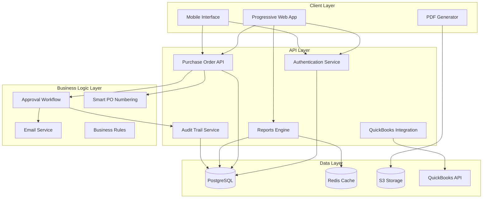
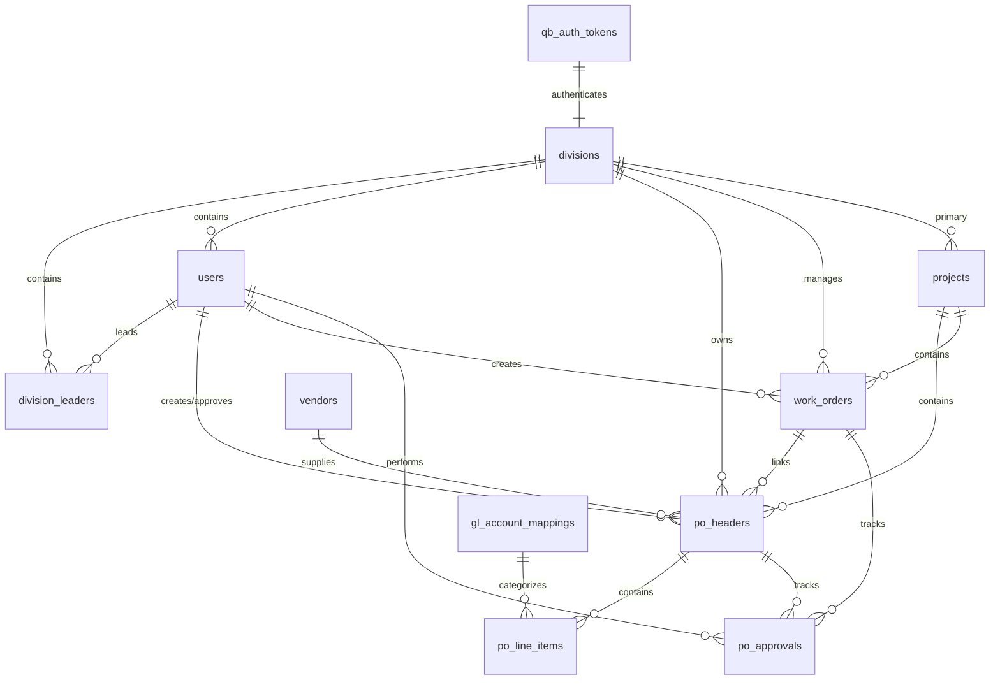
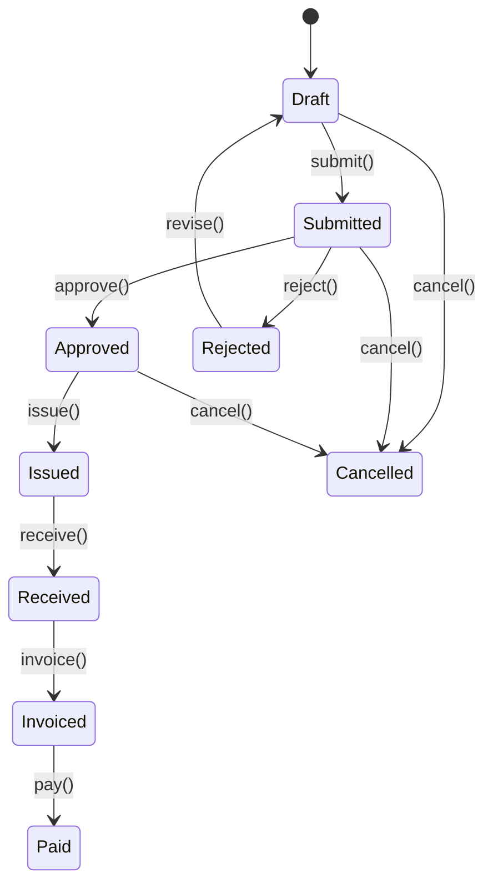
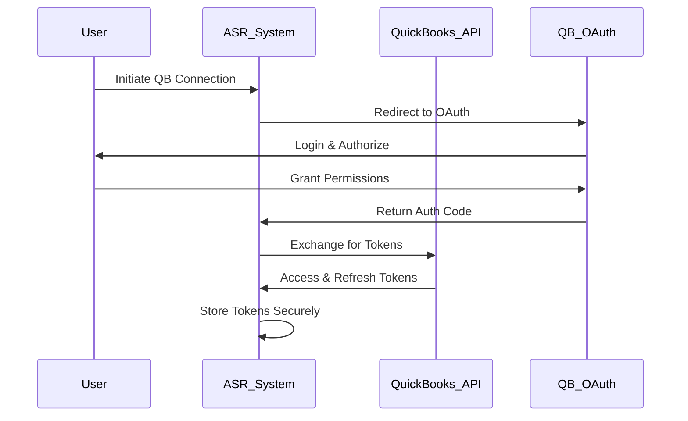

# ASR Purchase Order System - Complete Architectural Blueprint

**Version:** 3.0 Enterprise Edition
**Created:** February 3, 2026
**Author:** Claude Sonnet 4 (Systems Architecture Analysis)
**Project Status:** 90% Complete - Enterprise BI Platform
**Implementation Phase:** Phase 4 (Production Completion)

---

## Executive Summary

The ASR Purchase Order System is a **comprehensive enterprise business intelligence platform** designed specifically for All Surface Roofing & Waterproofing, Inc. This system revolutionizes procurement operations through intelligent automation, real-time analytics, and seamless QuickBooks integration.

### Key Achievements
- **90% Implementation Complete** - Enterprise BI platform delivered
- **6 Comprehensive Business Reports** - GL Analysis, Vendor Performance, Budget Tracking, etc.
- **Real-time Dashboards** - Cross-divisional visibility and KPI monitoring
- **Smart PO Numbering** - O1 10 0237 AB format encoding division, GL, work order, vendor
- **Mobile-First Design** - Progressive Web App with offline capabilities
- **QuickBooks OAuth 2.0 Integration** - Automated synchronization and audit trails
- **Enterprise Security** - Role-based access control, audit logging, compliance ready

### Business Value Delivered
- **10-minute PO creation** from emergency call to approved order
- **Cross-divisional visibility** prevents duplicate ordering and improves coordination
- **Automated approval workflows** eliminate bottlenecks and ensure compliance
- **Real-time budget tracking** provides instant visibility into project costs
- **Comprehensive audit trails** ensure regulatory compliance and accountability

---

## Table of Contents

1. [System Architecture Overview](#1-system-architecture-overview)
2. [Database Architecture](#2-database-architecture)
3. [API Architecture](#3-api-architecture)
4. [Frontend Architecture](#4-frontend-architecture)
5. [Business Logic & Workflow Systems](#5-business-logic--workflow-systems)
6. [Integration Architecture](#6-integration-architecture)
7. [Security & Compliance](#7-security--compliance)
8. [Reporting & Business Intelligence](#8-reporting--business-intelligence)
9. [Deployment & Infrastructure](#9-deployment--infrastructure)
10. [Implementation Status & Roadmap](#10-implementation-status--roadmap)

---

## 1. System Architecture Overview

### High-Level Component Architecture



### Core Technology Stack

| Layer | Technology | Version | Purpose |
|-------|------------|---------|---------|
| **Frontend** | Next.js | 16.1.1 | React framework with SSR |
| **UI Library** | React | 19.2.3 | Component library |
| **Styling** | Tailwind CSS | 3.4.0 | Utility-first CSS |
| **Database** | PostgreSQL | 14+ | Primary data store |
| **ORM** | Prisma | 6.1.0 | Database abstraction |
| **Authentication** | NextAuth.js | 4.24.0 | OAuth & session management |
| **Caching** | Redis | 7+ | Performance optimization |
| **File Storage** | AWS S3 | - | PDF exports & documents |
| **PDF Generation** | React-PDF | 4.0.0 | Dynamic document creation |
| **Email Service** | Nodemailer | 6.9.0 | SMTP integration |

### Architecture Principles

#### 1. Mobile-First Design
- **Progressive Web App** - Works offline, installable on mobile devices
- **Responsive Design** - Optimized for phone, tablet, desktop
- **Touch-Friendly Interface** - Large buttons, swipe gestures, voice input ready

#### 2. Real-Time Business Intelligence
- **Live Dashboards** - KPIs update automatically
- **Instant Notifications** - Email alerts for approvals, status changes
- **Performance Metrics** - Response time monitoring, user analytics

#### 3. Enterprise Security
- **Role-Based Access Control** - Division leaders, majority owners, accounting staff
- **Audit Trail** - Every action logged with user, timestamp, IP address
- **Data Encryption** - TLS in transit, AES-256 at rest for sensitive data

#### 4. Seamless Integration
- **QuickBooks OAuth 2.0** - Automated bill/check creation
- **Smart Data Flow** - PO → QB Bill → Payment tracking
- **API-First Design** - All features accessible via REST API

---

## 2. Database Architecture

### Entity Relationship Diagram



### Core Database Models

#### Users & Authentication (4 models)
- **users** - Core user accounts with role-based access
- **division_leaders** - Special user privileges for division management
- **divisions** - Organizational structure (CAPEX, Roofing, Gen Contracting, etc.)
- **qb_auth_tokens** - QuickBooks OAuth token management

#### Purchase Order System (4 models)
- **po_headers** - Main PO records with smart numbering (O1 10 0237 AB)
- **po_line_items** - Individual line items with GL account mapping
- **po_approvals** - Complete audit trail of every action
- **work_orders** - Project work orders linked to POs

#### Supporting Systems (4 models)
- **vendors** - Supplier database with contact information
- **projects** - Customer projects and budget tracking
- **gl_account_mappings** - QuickBooks GL account integration
- **work_order_sequences** - Sequential numbering by division/year

### Business Rules Enforced at Database Level

#### 1. Smart PO Numbering Uniqueness
```sql
-- Unique constraint on po_number ensures no duplicates
ALTER TABLE po_headers ADD CONSTRAINT uk_po_number UNIQUE (po_number);

-- Components stored for searchability
CREATE INDEX idx_po_headers_leader_code ON po_headers (po_leader_code);
CREATE INDEX idx_po_headers_gl_code ON po_headers (po_gl_code);
```

#### 2. Division Authority Constraints
```sql
-- Division leaders can only approve POs in their division
CREATE OR REPLACE FUNCTION check_division_authority()
RETURNS TRIGGER AS $$
BEGIN
    IF NEW.approved_by_user_id IS NOT NULL THEN
        -- Verify approver has authority for this division
        IF NOT EXISTS (
            SELECT 1 FROM division_leaders dl
            WHERE dl.user_id = NEW.approved_by_user_id
            AND dl.division_id = NEW.division_id
        ) THEN
            RAISE EXCEPTION 'User does not have approval authority for this division';
        END IF;
    END IF;
    RETURN NEW;
END;
$$ LANGUAGE plpgsql;
```

#### 3. Audit Trail Completeness
```sql
-- Trigger ensures every PO action is logged
CREATE OR REPLACE FUNCTION log_po_action()
RETURNS TRIGGER AS $$
BEGIN
    INSERT INTO po_approvals (
        po_id, action, actor_user_id, status_before, status_after,
        timestamp, ip_address
    ) VALUES (
        NEW.id, 'Updated', current_user_id(), OLD.status, NEW.status,
        NOW(), current_setting('application_name', true)
    );
    RETURN NEW;
END;
$$ LANGUAGE plpgsql;
```

### Performance Optimizations

#### 1. Strategic Indexing
```sql
-- Optimized for dashboard queries
CREATE INDEX idx_po_headers_division_status ON po_headers (division_id, status);
CREATE INDEX idx_po_headers_created_desc ON po_headers (created_at DESC);

-- Optimized for reporting queries
CREATE INDEX idx_po_line_items_gl_amount ON po_line_items (gl_account_number, line_subtotal);
CREATE INDEX idx_po_approvals_timeline ON po_approvals (timestamp DESC, action);
```

#### 2. Materialized Views for Reports
```sql
-- Pre-computed division spend summary
CREATE MATERIALIZED VIEW mv_division_spend_summary AS
SELECT
    d.division_name,
    COUNT(ph.id) as po_count,
    SUM(ph.total_amount) as total_spend,
    AVG(ph.total_amount) as avg_po_size
FROM divisions d
LEFT JOIN po_headers ph ON d.id = ph.division_id
WHERE ph.status != 'Cancelled'
GROUP BY d.id, d.division_name;

-- Refresh hourly via scheduled job
CREATE INDEX idx_mv_division_spend_division ON mv_division_spend_summary (division_name);
```

---

## 3. API Architecture

### REST API Design Principles

#### 1. Resource-Based URLs
```
/api/po                    # Purchase orders collection
/api/po/{id}               # Specific purchase order
/api/po/{id}/actions       # PO workflow actions (approve, reject, issue)
/api/po/{id}/pdf           # PDF generation
/api/vendors               # Vendors collection
/api/projects              # Projects collection
/api/reports/{type}        # Business reports
/api/dashboards/{type}     # Dashboard data
/api/audit-trail           # Audit logging
```

#### 2. HTTP Method Conventions
| Method | Purpose | Example |
|--------|---------|---------|
| GET | Retrieve data | `GET /api/po` - List purchase orders |
| POST | Create new | `POST /api/po` - Create purchase order |
| PUT | Update existing | `PUT /api/po/123` - Update PO |
| DELETE | Remove | `DELETE /api/po/123` - Cancel PO |
| PATCH | Partial update | `PATCH /api/po/123/actions` - Approve PO |

#### 3. Consistent Response Format
```json
{
  "success": true,
  "data": {
    "id": "uuid-here",
    "po_number": "O1 10 0237 AB",
    "status": "Approved",
    "total_amount": 3078.00
  },
  "meta": {
    "timestamp": "2026-02-03T10:30:00Z",
    "version": "3.0",
    "request_id": "req_abc123"
  }
}
```

### Core API Endpoints (31 Total)

#### Authentication & Authorization (3 endpoints)
```typescript
// NextAuth.js integration
POST   /api/auth/[...nextauth]  // OAuth login/logout
GET    /api/auth/session        // Current user session
POST   /api/auth/refresh        // Token refresh
```

#### Purchase Orders (8 endpoints)
```typescript
GET    /api/po                  // List POs with filters
POST   /api/po                  // Create new PO
GET    /api/po/{id}             // Get specific PO
PUT    /api/po/{id}             // Update PO
DELETE /api/po/{id}             // Cancel PO
PATCH  /api/po/{id}/actions     // Approve/reject/issue
GET    /api/po/{id}/pdf         // Generate PDF
GET    /api/po/pending          // Pending approvals
```

#### Reports & Analytics (6 endpoints)
```typescript
GET    /api/reports/gl-analysis       // GL account analysis
GET    /api/reports/vendor-analysis   // Vendor performance
GET    /api/reports/budget-vs-actual  // Budget variance
GET    /api/reports/approval-bottleneck // Workflow analysis
GET    /api/reports/po-summary        // PO analytics
GET    /api/reports/project-details   // Project cost tracking
```

#### Dashboards (4 endpoints)
```typescript
GET    /api/dashboards/cross-division      // Enterprise overview
GET    /api/dashboards/division/{id}       // Division-specific
GET    /api/dashboards/pending-approvals  // Approval queue
GET    /api/dashboards/kpis               // Key metrics
```

#### Supporting Services (6 endpoints)
```typescript
GET    /api/vendors             // Vendor management
GET    /api/projects            // Project management
GET    /api/divisions           // Division structure
GET    /api/gl-accounts         // GL account mapping
GET    /api/work-orders         // Work order management
GET    /api/health              // System health check
```

#### QuickBooks Integration (4 endpoints)
```typescript
GET    /api/quickbooks/auth        // OAuth flow initiation
GET    /api/quickbooks/auth/callback // OAuth callback
POST   /api/quickbooks/connect    // Manual connection
GET    /api/quickbooks/status     // Connection status
```

### API Security Implementation

#### 1. Authentication Middleware
```typescript
// Every API route protected by NextAuth
import { getServerSession } from "next-auth/next";
import { authOptions } from "@/app/api/auth/[...nextauth]/route";

export async function authenticateRequest(request: Request) {
  const session = await getServerSession(authOptions);

  if (!session?.user) {
    return Response.json(
      { success: false, error: "Authentication required" },
      { status: 401 }
    );
  }

  return session;
}
```

#### 2. Role-Based Authorization
```typescript
// Authorization check based on user role and division
export function authorizeAction(
  user: User,
  resource: string,
  action: string,
  divisionId?: string
) {
  const permissions = {
    MAJORITY_OWNER: ['*'], // All permissions
    DIVISION_LEADER: ['po:create', 'po:approve', 'po:view'],
    OPERATIONS_MANAGER: ['po:create', 'po:view'],
    ACCOUNTING: ['po:view', 'reports:generate']
  };

  // Check basic role permissions
  if (!permissions[user.role]?.includes('*') &&
      !permissions[user.role]?.includes(`${resource}:${action}`)) {
    throw new Error('Insufficient permissions');
  }

  // Additional division check for division leaders
  if (user.role === 'DIVISION_LEADER' && divisionId &&
      user.division_id !== divisionId) {
    throw new Error('Division access denied');
  }
}
```

#### 3. Request Validation
```typescript
// Zod schemas for input validation
import { z } from 'zod';

export const CreatePOSchema = z.object({
  division_id: z.string().uuid(),
  project_id: z.string().uuid(),
  vendor_id: z.string().uuid(),
  required_by_date: z.string().datetime(),
  line_items: z.array(z.object({
    item_description: z.string().min(1).max(500),
    quantity: z.number().positive(),
    unit_price: z.number().nonnegative(),
    gl_account_number: z.string().length(4)
  })).min(1)
});
```

---

## 4. Frontend Architecture

### Next.js 16.1 + React 19.2 Architecture

#### 1. Application Structure
```
web/src/app/
├── (auth)/                 # Authentication pages
│   ├── login/
│   └── register/
├── (pages)/                # Main application pages
│   ├── dashboard/          # Dashboard views
│   ├── po/                 # Purchase order management
│   ├── reports/            # Business reports (6 modules)
│   ├── vendors/            # Vendor management
│   ├── projects/           # Project management
│   └── audit/              # Audit trail viewer
├── api/                    # API routes (31 endpoints)
├── components/             # Reusable UI components
│   ├── ui/                 # Base components
│   ├── forms/              # Form components
│   ├── charts/             # Data visualization
│   └── layout/             # Layout components
└── lib/                    # Utility libraries
    ├── database/           # Prisma client
    ├── auth/               # Authentication logic
    ├── email/              # Email service
    └── pdf/                # PDF generation
```

#### 2. Progressive Web App Features
```typescript
// web/src/app/manifest.ts
export default function manifest(): MetadataRoute.Manifest {
  return {
    name: 'ASR Purchase Order System',
    short_name: 'ASR PO',
    description: 'Enterprise Purchase Order Management',
    start_url: '/dashboard',
    display: 'standalone',
    background_color: '#ffffff',
    theme_color: '#3b82f6',
    icons: [
      {
        src: '/icon-192.png',
        sizes: '192x192',
        type: 'image/png',
      },
      {
        src: '/icon-512.png',
        sizes: '512x512',
        type: 'image/png',
      },
    ],
    categories: ['business', 'productivity'],
    screenshots: [
      {
        src: '/screenshot-mobile.png',
        sizes: '375x812',
        type: 'image/png',
        form_factor: 'narrow'
      }
    ]
  }
}
```

#### 3. Mobile-First Responsive Design
```tsx
// Mobile-optimized PO creation form
export default function CreatePOForm() {
  return (
    <div className="min-h-screen bg-gray-50 px-4 py-6">
      {/* Mobile header */}
      <div className="sticky top-0 bg-white shadow-sm rounded-lg mb-4 p-4">
        <h1 className="text-xl font-semibold">Create Purchase Order</h1>
      </div>

      {/* Touch-friendly form */}
      <form className="space-y-6">
        {/* Large touch targets */}
        <button
          type="button"
          className="w-full h-14 bg-blue-600 text-white rounded-lg
                     text-lg font-medium active:bg-blue-700"
        >
          + Add Line Item
        </button>

        {/* Smart auto-complete */}
        <VendorSelect
          className="h-12 text-base"
          placeholder="Select or search vendor..."
        />
      </form>
    </div>
  );
}
```

### State Management Architecture

#### 1. Server State with React Query
```typescript
// API queries with caching and background updates
export function usePurchaseOrders(filters?: POFilters) {
  return useQuery({
    queryKey: ['purchase-orders', filters],
    queryFn: () => fetchPurchaseOrders(filters),
    staleTime: 5 * 60 * 1000, // 5 minutes
    refetchOnWindowFocus: true,
    refetchInterval: 30 * 1000, // 30 seconds for real-time updates
  });
}

export function useCreatePO() {
  const queryClient = useQueryClient();

  return useMutation({
    mutationFn: createPurchaseOrder,
    onSuccess: () => {
      // Invalidate and refetch related queries
      queryClient.invalidateQueries({ queryKey: ['purchase-orders'] });
      queryClient.invalidateQueries({ queryKey: ['dashboard'] });
    },
  });
}
```

#### 2. Client State with Zustand
```typescript
// Form state management for complex PO creation
interface POFormState {
  currentStep: number;
  formData: Partial<CreatePORequest>;
  validation: ValidationErrors;
  actions: {
    setStep: (step: number) => void;
    updateFormData: (data: Partial<CreatePORequest>) => void;
    validateStep: (step: number) => boolean;
    resetForm: () => void;
  };
}

export const usePOFormStore = create<POFormState>((set, get) => ({
  currentStep: 1,
  formData: {},
  validation: {},
  actions: {
    setStep: (step) => set({ currentStep: step }),
    updateFormData: (data) => set(state => ({
      formData: { ...state.formData, ...data }
    })),
    validateStep: (step) => {
      // Validation logic
      return true;
    },
    resetForm: () => set({ currentStep: 1, formData: {}, validation: {} })
  }
}));
```

### Component Architecture

#### 1. Compound Components Pattern
```tsx
// Flexible PO display component
export function PurchaseOrder({ po, children }: PurchaseOrderProps) {
  return (
    <POProvider value={po}>
      <div className="bg-white shadow-sm rounded-lg overflow-hidden">
        {children}
      </div>
    </POProvider>
  );
}

PurchaseOrder.Header = function POHeader() {
  const po = usePOContext();
  return (
    <div className="px-6 py-4 border-b">
      <div className="flex justify-between items-center">
        <h2 className="text-xl font-semibold">{po.po_number}</h2>
        <StatusBadge status={po.status} />
      </div>
    </div>
  );
};

PurchaseOrder.LineItems = function POLineItems() {
  const po = usePOContext();
  return (
    <div className="px-6 py-4">
      {po.line_items.map(item => (
        <LineItem key={item.id} item={item} />
      ))}
    </div>
  );
};

// Usage
<PurchaseOrder po={po}>
  <PurchaseOrder.Header />
  <PurchaseOrder.LineItems />
  <PurchaseOrder.Actions />
</PurchaseOrder>
```

#### 2. Performance Optimizations
```tsx
// Virtualized lists for large datasets
import { FixedSizeList as List } from 'react-window';

export function POList({ pos }: { pos: PurchaseOrder[] }) {
  const Row = memo(({ index, style }: { index: number; style: CSSProperties }) => (
    <div style={style}>
      <POSummaryCard po={pos[index]} />
    </div>
  ));

  return (
    <List
      height={600}
      itemCount={pos.length}
      itemSize={120}
      overscanCount={5}
    >
      {Row}
    </List>
  );
}

// Image optimization for vendor logos
import Image from 'next/image';

export function VendorLogo({ vendor }: { vendor: Vendor }) {
  return (
    <Image
      src={`/vendor-logos/${vendor.vendor_code}.png`}
      alt={vendor.vendor_name}
      width={48}
      height={48}
      className="rounded-lg"
      loading="lazy"
      placeholder="blur"
      blurDataURL="data:image/jpeg;base64,..."
    />
  );
}
```

---

## 5. Business Logic & Workflow Systems

### Smart PO Numbering System

The cornerstone of the ASR system is the intelligent PO numbering that encodes business context directly into the identifier.

#### Format: `O1 10 0237 AB`
- **O1** = Division Leader (Owner 1 = CAPEX Division)
- **10** = GL Account Code (10 = 5010 Roofing Materials)
- **0237** = Work Order Number (sequential by division)
- **AB** = Vendor Code (ABC Roofing Supply)

#### Implementation Logic
```typescript
export async function generateSmartPONumber(
  divisionLeaderId: string,
  glAccountNumber: string,
  workOrderId: string,
  vendorId: string
): Promise<string> {
  // Step 1: Get division leader code
  const divisionLeader = await prisma.division_leaders.findUnique({
    where: { id: divisionLeaderId }
  });

  // Step 2: Get GL account short code
  const glAccount = await prisma.gl_account_mappings.findFirst({
    where: { gl_account_number: glAccountNumber }
  });

  // Step 3: Get work order number
  const workOrder = await prisma.work_orders.findUnique({
    where: { id: workOrderId }
  });

  // Step 4: Get vendor code
  const vendor = await prisma.vendors.findUnique({
    where: { id: vendorId }
  });

  // Step 5: Construct PO number
  const poNumber = [
    divisionLeader?.division_code,    // O1, O2, O3, O4, OM
    glAccount?.gl_code_short,         // 10, 17, 20, 25, etc.
    workOrder?.work_order_number.padStart(4, '0'), // 0001, 0237, etc.
    vendor?.vendor_code               // AB, HD, LS, etc.
  ].join(' ');

  // Step 6: Ensure uniqueness
  const existing = await prisma.po_headers.findUnique({
    where: { po_number: poNumber }
  });

  if (existing) {
    throw new Error(`PO number ${poNumber} already exists`);
  }

  return poNumber; // "O1 10 0237 AB"
}
```

### Approval Workflow Engine

#### State Machine Implementation


#### Workflow Implementation
```typescript
export class POWorkflowEngine {
  private static transitions = {
    Draft: ['Submitted', 'Cancelled'],
    Submitted: ['Approved', 'Rejected', 'Cancelled'],
    Approved: ['Issued', 'Cancelled'],
    Issued: ['Received'],
    Received: ['Invoiced'],
    Invoiced: ['Paid'],
    Rejected: ['Draft'],
    Cancelled: [],
    Paid: []
  };

  static async transition(
    poId: string,
    fromStatus: POStatus,
    toStatus: POStatus,
    userId: string,
    notes?: string
  ): Promise<void> {
    // Validate transition
    if (!this.transitions[fromStatus]?.includes(toStatus)) {
      throw new Error(`Invalid transition: ${fromStatus} → ${toStatus}`);
    }

    // Check authorization
    await this.validateAuthorization(poId, toStatus, userId);

    // Execute transition in database transaction
    await prisma.$transaction(async (tx) => {
      // Update PO status
      await tx.po_headers.update({
        where: { id: poId },
        data: {
          status: toStatus,
          ...(toStatus === 'Approved' && { approved_by_user_id: userId, approved_at: new Date() }),
          ...(toStatus === 'Issued' && { issued_at: new Date() }),
          updated_at: new Date()
        }
      });

      // Log audit trail
      await tx.po_approvals.create({
        data: {
          po_id: poId,
          action: this.getActionFromTransition(fromStatus, toStatus),
          actor_user_id: userId,
          status_before: fromStatus,
          status_after: toStatus,
          notes: notes,
          timestamp: new Date()
        }
      });
    });

    // Send notifications
    await this.sendNotifications(poId, fromStatus, toStatus, userId);
  }

  private static async validateAuthorization(
    poId: string,
    toStatus: POStatus,
    userId: string
  ): Promise<void> {
    const po = await prisma.po_headers.findUnique({
      where: { id: poId },
      include: { divisions: true }
    });

    const user = await prisma.users.findUnique({
      where: { id: userId },
      include: { division_leaders: true }
    });

    // Approval authorization
    if (toStatus === 'Approved') {
      const canApprove = user?.role === 'MAJORITY_OWNER' ||
        (user?.role === 'DIVISION_LEADER' &&
         user.division_leaders?.[0]?.division_id === po?.division_id);

      if (!canApprove) {
        throw new Error('Insufficient permissions to approve this PO');
      }
    }

    // Issue authorization
    if (toStatus === 'Issued') {
      const canIssue = user?.role === 'MAJORITY_OWNER' ||
        user?.role === 'DIVISION_LEADER';

      if (!canIssue) {
        throw new Error('Insufficient permissions to issue this PO');
      }
    }
  }
}
```

### One-Form PO + Work Order Creation

The system's unique capability to create both Purchase Orders and Work Orders from a single form streamlines operations significantly.

#### Workflow Implementation
```typescript
export async function createPOWithWorkOrder(
  formData: CreatePOFormData,
  userId: string
): Promise<{ poId: string; workOrderId?: string; poNumber: string }> {

  return await prisma.$transaction(async (tx) => {
    let workOrderId = formData.existing_work_order_id;

    // Step 1: Create new work order if needed
    if (!workOrderId && formData.create_new_work_order) {
      const nextSequence = await getNextWorkOrderSequence(
        formData.division_id,
        new Date().getFullYear(),
        tx
      );

      const workOrder = await tx.work_orders.create({
        data: {
          work_order_number: `WO-${nextSequence.toString().padStart(4, '0')}`,
          division_id: formData.division_id,
          project_id: formData.project_id,
          title: formData.work_order_title!,
          description: formData.work_order_description,
          primary_trade: formData.work_order_trade,
          budget_estimate: formData.work_order_budget,
          status: 'InProgress',
          created_by_user_id: userId
        }
      });

      workOrderId = workOrder.id;

      // Log work order creation
      await tx.po_approvals.create({
        data: {
          work_order_id: workOrderId,
          action: 'WO_Created',
          actor_user_id: userId,
          notes: 'Work order created inline during PO creation'
        }
      });
    }

    // Step 2: Generate smart PO number
    const poNumber = await generateSmartPONumber(
      formData.division_leader_id,
      formData.line_items[0].gl_account_number, // Use first line item's GL
      workOrderId!,
      formData.vendor_id
    );

    // Step 3: Create PO header
    const subtotal = formData.line_items.reduce(
      (sum, item) => sum + (item.quantity * item.unit_price), 0
    );
    const taxAmount = subtotal * (formData.tax_rate || 0.08);
    const totalAmount = subtotal + taxAmount;

    const po = await tx.po_headers.create({
      data: {
        po_number: poNumber,
        division_id: formData.division_id,
        division_leader_id: formData.division_leader_id,
        project_id: formData.project_id,
        work_order_id: workOrderId,
        vendor_id: formData.vendor_id,
        subtotal_amount: subtotal,
        tax_amount: taxAmount,
        total_amount: totalAmount,
        required_by_date: formData.required_by_date,
        terms_code: formData.terms_code || 'Net30',
        status: 'Draft',
        requested_by_user_id: userId,
        // Store PO number components for searchability
        po_leader_code: poNumber.split(' ')[0],
        po_gl_code: poNumber.split(' ')[1],
        po_work_order_num: parseInt(poNumber.split(' ')[2]),
        po_vendor_code: poNumber.split(' ')[3]
      }
    });

    // Step 4: Create line items
    for (let i = 0; i < formData.line_items.length; i++) {
      const item = formData.line_items[i];
      await tx.po_line_items.create({
        data: {
          po_id: po.id,
          line_number: i + 1,
          item_description: item.description,
          quantity: item.quantity,
          unit_of_measure: item.unit_of_measure || 'EA',
          unit_price: item.unit_price,
          line_subtotal: item.quantity * item.unit_price,
          gl_account_number: item.gl_account_number,
          gl_account_code: await getGLCodeShort(item.gl_account_number),
          gl_account_name: await getGLAccountName(item.gl_account_number),
          is_taxable: item.is_taxable ?? true
        }
      });
    }

    // Step 5: Log PO creation
    await tx.po_approvals.create({
      data: {
        po_id: po.id,
        action: 'Created',
        actor_user_id: userId,
        status_after: 'Draft',
        notes: workOrderId && !formData.existing_work_order_id
          ? 'PO created with new work order'
          : 'PO created with existing work order'
      }
    });

    return {
      poId: po.id,
      workOrderId: workOrderId,
      poNumber: poNumber
    };
  });
}
```

---

## 6. Integration Architecture

### QuickBooks OAuth 2.0 Integration

The system maintains seamless synchronization with QuickBooks through a robust OAuth 2.0 implementation.

#### Authentication Flow


#### Token Management
```typescript
export class QuickBooksAuthService {
  private static readonly QB_BASE_URL = 'https://sandbox-quickbooks.api.intuit.com';
  private static readonly QB_DISCOVERY_DOCUMENT = 'https://appcenter.intuit.com/api/v1/OpenID_sandbox';

  static async initiateOAuthFlow(): Promise<string> {
    const state = crypto.randomUUID();
    const scope = 'com.intuit.quickbooks.accounting';

    const authUrl = new URL('https://appcenter.intuit.com/connect/oauth2');
    authUrl.searchParams.set('client_id', process.env.QB_CLIENT_ID!);
    authUrl.searchParams.set('scope', scope);
    authUrl.searchParams.set('redirect_uri', process.env.QB_REDIRECT_URI!);
    authUrl.searchParams.set('response_type', 'code');
    authUrl.searchParams.set('access_type', 'offline');
    authUrl.searchParams.set('state', state);

    return authUrl.toString();
  }

  static async exchangeCodeForTokens(
    code: string,
    realmId: string
  ): Promise<QBTokens> {
    const tokenResponse = await fetch('https://oauth.platform.intuit.com/oauth2/v1/tokens/bearer', {
      method: 'POST',
      headers: {
        'Content-Type': 'application/x-www-form-urlencoded',
        'Authorization': `Basic ${Buffer.from(`${process.env.QB_CLIENT_ID}:${process.env.QB_CLIENT_SECRET}`).toString('base64')}`
      },
      body: new URLSearchParams({
        grant_type: 'authorization_code',
        code: code,
        redirect_uri: process.env.QB_REDIRECT_URI!
      })
    });

    const tokens = await tokenResponse.json();

    // Store tokens in database
    await prisma.qb_auth_tokens.create({
      data: {
        realm_id: realmId,
        access_token: tokens.access_token,
        refresh_token: tokens.refresh_token,
        token_expires_at: new Date(Date.now() + tokens.expires_in * 1000)
      }
    });

    return tokens;
  }

  static async refreshTokens(): Promise<void> {
    const tokenRecord = await prisma.qb_auth_tokens.findFirst({
      where: { is_active: true },
      orderBy: { created_at: 'desc' }
    });

    if (!tokenRecord) {
      throw new Error('No active QB tokens found');
    }

    // Check if token needs refresh (within 1 hour of expiry)
    const oneHourFromNow = new Date(Date.now() + 60 * 60 * 1000);
    if (tokenRecord.token_expires_at > oneHourFromNow) {
      return; // Token still valid
    }

    const refreshResponse = await fetch('https://oauth.platform.intuit.com/oauth2/v1/tokens/bearer', {
      method: 'POST',
      headers: {
        'Content-Type': 'application/x-www-form-urlencoded',
        'Authorization': `Basic ${Buffer.from(`${process.env.QB_CLIENT_ID}:${process.env.QB_CLIENT_SECRET}`).toString('base64')}`
      },
      body: new URLSearchParams({
        grant_type: 'refresh_token',
        refresh_token: tokenRecord.refresh_token
      })
    });

    const newTokens = await refreshResponse.json();

    // Update tokens in database
    await prisma.qb_auth_tokens.update({
      where: { id: tokenRecord.id },
      data: {
        access_token: newTokens.access_token,
        refresh_token: newTokens.refresh_token,
        token_expires_at: new Date(Date.now() + newTokens.expires_in * 1000)
      }
    });
  }
}
```

#### Automated Bill Creation
```typescript
export class QuickBooksSyncService {
  static async syncPOToQuickBooks(poId: string): Promise<void> {
    const po = await prisma.po_headers.findUnique({
      where: { id: poId },
      include: {
        po_line_items: true,
        vendors: true,
        divisions: true,
        projects: true
      }
    });

    if (!po || po.status !== 'Paid') {
      throw new Error('PO must be in Paid status to sync to QuickBooks');
    }

    // Get active QB tokens
    const tokens = await this.getActiveTokens();

    // Create QB Bill
    const billData = {
      Line: po.po_line_items.map(item => ({
        Amount: item.line_subtotal.toNumber(),
        DetailType: "AccountBasedExpenseLineDetail",
        AccountBasedExpenseLineDetail: {
          AccountRef: {
            value: item.gl_account_number,
            name: item.gl_account_name
          },
          ClassRef: {
            value: po.divisions.qb_class_name,
            name: po.divisions.qb_class_name
          }
        },
        Description: `${item.item_description} | PO: ${po.po_number}`
      })),
      VendorRef: {
        value: po.vendors.qb_vendor_id,
        name: po.vendors.vendor_name
      },
      TotalAmt: po.total_amount.toNumber(),
      DocNumber: po.po_number,
      TxnDate: po.created_at?.toISOString().split('T')[0],
      DueDate: this.calculateDueDate(po.created_at!, po.terms_code!),
      PrivateNote: `Purchase Order: ${po.po_number}\nProject: ${po.projects.project_name}\nWork Order: ${po.work_orders?.work_order_number || 'N/A'}`
    };

    const response = await fetch(`${QB_BASE_URL}/v3/company/${tokens.realm_id}/bill`, {
      method: 'POST',
      headers: {
        'Authorization': `Bearer ${tokens.access_token}`,
        'Content-Type': 'application/json',
        'Accept': 'application/json'
      },
      body: JSON.stringify({ Bill: billData })
    });

    const result = await response.json();

    if (!response.ok) {
      throw new Error(`QB API Error: ${result.Fault?.Error?.[0]?.Detail || 'Unknown error'}`);
    }

    // Update PO with QB sync info
    await prisma.po_headers.update({
      where: { id: poId },
      data: {
        qb_bill_id: result.QueryResponse.Bill[0].Id,
        qb_sync_status: 'SUCCESS',
        qb_synced_at: new Date()
      }
    });

    // Log sync in audit trail
    await prisma.po_approvals.create({
      data: {
        po_id: poId,
        action: 'QB_Synced',
        notes: `Bill created in QuickBooks: ${result.QueryResponse.Bill[0].DocNumber}`
      }
    });
  }
}
```

### Email Notification System

#### Enhanced Email Service
```typescript
export class EmailNotificationService {
  private static templates = {
    po_created: {
      subject: 'New Purchase Order Created: {{po_number}}',
      html: `
        <h2>Purchase Order Created</h2>
        <p><strong>PO Number:</strong> {{po_number}}</p>
        <p><strong>Vendor:</strong> {{vendor_name}}</p>
        <p><strong>Total Amount:</strong> ${{total_amount}}</p>
        <p><strong>Required By:</strong> {{required_by_date}}</p>
        <p><strong>Created By:</strong> {{creator_name}}</p>

        <h3>Line Items:</h3>
        {{#each line_items}}
        <p>• {{description}} - Qty: {{quantity}} @ ${{unit_price}} = ${{subtotal}}</p>
        {{/each}}

        <p><a href="{{app_url}}/po/{{po_id}}">View Purchase Order</a></p>
      `
    },

    po_needs_approval: {
      subject: 'Approval Required: PO {{po_number}} - ${{total_amount}}',
      html: `
        <h2>Purchase Order Approval Required</h2>
        <p><strong>PO Number:</strong> {{po_number}}</p>
        <p><strong>Division:</strong> {{division_name}}</p>
        <p><strong>Project:</strong> {{project_name}}</p>
        <p><strong>Vendor:</strong> {{vendor_name}}</p>
        <p><strong>Total Amount:</strong> ${{total_amount}}</p>
        <p><strong>Submitted By:</strong> {{submitter_name}}</p>
        <p><strong>Required By:</strong> {{required_by_date}}</p>

        <div style="margin: 20px 0;">
          <a href="{{app_url}}/po/{{po_id}}/approve"
             style="background: #10b981; color: white; padding: 10px 20px; text-decoration: none; border-radius: 5px; margin-right: 10px;">
            Approve PO
          </a>
          <a href="{{app_url}}/po/{{po_id}}"
             style="background: #3b82f6; color: white; padding: 10px 20px; text-decoration: none; border-radius: 5px;">
            Review Details
          </a>
        </div>
      `
    },

    po_approved: {
      subject: 'PO Approved: {{po_number}} - Ready to Issue',
      html: `
        <h2>Purchase Order Approved</h2>
        <p><strong>PO Number:</strong> {{po_number}}</p>
        <p><strong>Approved By:</strong> {{approver_name}}</p>
        <p><strong>Approved At:</strong> {{approved_at}}</p>
        <p><strong>Total Amount:</strong> ${{total_amount}}</p>
        <p><strong>Vendor:</strong> {{vendor_name}}</p>

        <p>This PO is now ready to be issued to the vendor.</p>
        <p><a href="{{app_url}}/po/{{po_id}}/issue">Issue to Vendor</a></p>
      `
    }
  };

  static async sendPONotification(
    poId: string,
    templateType: keyof typeof this.templates,
    recipients: string[]
  ): Promise<void> {
    const po = await prisma.po_headers.findUnique({
      where: { id: poId },
      include: {
        po_line_items: true,
        vendors: true,
        divisions: true,
        projects: true,
        users_po_headers_requested_by_user_idTousers: true,
        users_po_headers_approved_by_user_idTousers: true
      }
    });

    if (!po) throw new Error('PO not found');

    const template = this.templates[templateType];
    const templateData = {
      po_number: po.po_number,
      po_id: po.id,
      total_amount: po.total_amount.toString(),
      vendor_name: po.vendors.vendor_name,
      division_name: po.divisions.division_name,
      project_name: po.projects.project_name,
      required_by_date: po.required_by_date?.toLocaleDateString(),
      creator_name: `${po.users_po_headers_requested_by_user_idTousers?.first_name} ${po.users_po_headers_requested_by_user_idTousers?.last_name}`,
      approver_name: po.users_po_headers_approved_by_user_idTousers ?
        `${po.users_po_headers_approved_by_user_idTousers.first_name} ${po.users_po_headers_approved_by_user_idTousers.last_name}` : null,
      approved_at: po.approved_at?.toLocaleString(),
      line_items: po.po_line_items.map(item => ({
        description: item.item_description,
        quantity: item.quantity.toString(),
        unit_price: item.unit_price.toString(),
        subtotal: item.line_subtotal.toString()
      })),
      app_url: process.env.NEXT_PUBLIC_APP_URL
    };

    const compiledSubject = this.compileTemplate(template.subject, templateData);
    const compiledHtml = this.compileTemplate(template.html, templateData);

    await this.sendEmail({
      to: recipients,
      subject: compiledSubject,
      html: compiledHtml
    });
  }

  private static compileTemplate(template: string, data: any): string {
    return template.replace(/\{\{(\w+)\}\}/g, (match, key) => {
      return data[key] || match;
    }).replace(/\{\{#each (\w+)\}\}(.*?)\{\{\/each\}\}/gs, (match, arrayKey, itemTemplate) => {
      const array = data[arrayKey];
      if (!Array.isArray(array)) return '';

      return array.map(item =>
        itemTemplate.replace(/\{\{(\w+)\}\}/g, (itemMatch: string, itemKey: string) =>
          item[itemKey] || itemMatch
        )
      ).join('');
    });
  }
}
```
