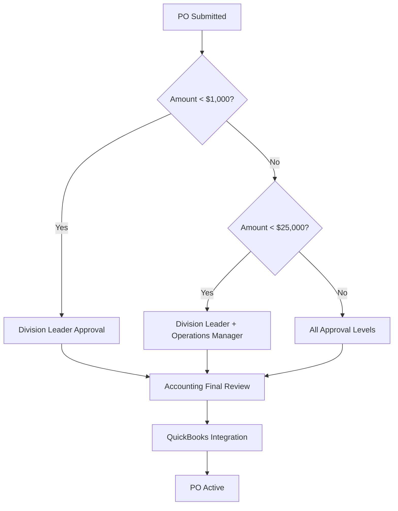
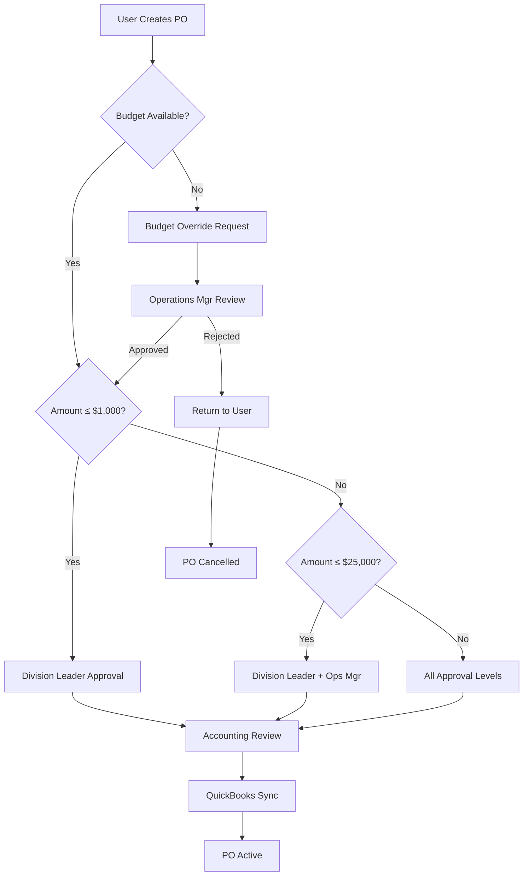
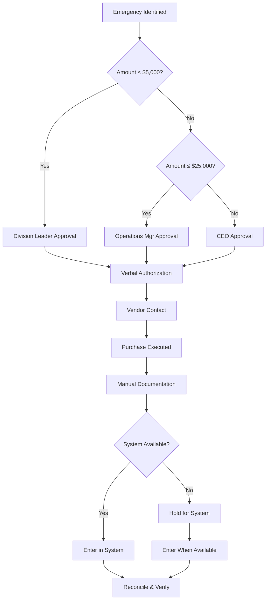

# ASR Purchase Order System
## Standard Operating Procedure (SOP)

---

**Document Control Information**

| Field | Value |
|-------|-------|
| **Document Title** | ASR Purchase Order System - Standard Operating Procedure |
| **Document ID** | ASR-SOP-PO-001 |
| **Version** | 1.0 |
| **Effective Date** | January 12, 2026 |
| **Next Review Date** | January 12, 2027 |
| **Document Owner** | Austin Kidwell, CEO (akidwell@asr-inc.us) |
| **Document Type** | Standard Operating Procedure |
| **Classification** | Internal Use Only |
| **Distribution** | All ASR Staff |

**Approval Matrix**

| Role | Name | Signature | Date |
|------|------|-----------|------|
| **Author** | Austin Kidwell | _[Digital Signature Required]_ | 2026-01-12 |
| **Technical Reviewer** | IT Operations Manager | _[Pending Review]_ | _[Pending]_ |
| **Quality Assurance** | Compliance Officer | _[Pending Review]_ | _[Pending]_ |
| **Final Approver** | CEO | _[Pending Final Approval]_ | _[Pending]_ |

**Revision History**

| Version | Date | Author | Description of Changes |
|---------|------|--------|------------------------|
| 1.0 | 2026-01-12 | Austin Kidwell | Initial SOP creation |

---

## Table of Contents

1. [Purpose and Scope](#1-purpose-and-scope)
2. [Definitions and Abbreviations](#2-definitions-and-abbreviations)
3. [Roles and Responsibilities](#3-roles-and-responsibilities)
4. [System Overview and Architecture](#4-system-overview-and-architecture)
5. [Purchase Order Creation Procedures](#5-purchase-order-creation-procedures)
6. [Approval Workflow Procedures](#6-approval-workflow-procedures)
7. [Reporting and Analytics Procedures](#7-reporting-and-analytics-procedures)
8. [Mobile Application Procedures](#8-mobile-application-procedures)
9. [Quality Assurance and Compliance](#9-quality-assurance-and-compliance)
10. [Training and Competency Requirements](#10-training-and-competency-requirements)
11. [Risk Management and Security](#11-risk-management-and-security)
12. [Audit and Review Procedures](#12-audit-and-review-procedures)
13. [Document Control and Change Management](#13-document-control-and-change-management)
14. [Emergency Procedures](#14-emergency-procedures)
15. [Appendices](#15-appendices)

---

## 1. Purpose and Scope

### 1.1 Purpose

This Standard Operating Procedure (SOP) establishes the mandatory processes, procedures, and controls for the ASR Purchase Order System. It ensures consistent, compliant, and efficient purchase order management across all ASR divisions while maintaining proper financial controls and audit trails.

### 1.2 Scope

This SOP applies to:
- **Personnel**: All ASR staff members across all divisions (CH, PW, WS, LS)
- **Systems**: The ASR Purchase Order System (Web and Mobile applications)
- **Processes**: Purchase order creation, approval, reporting, and financial integration
- **Data**: All purchase order transactions, vendor management, and financial reporting
- **Compliance**: Internal controls, audit requirements, and QuickBooks integration

### 1.3 Regulatory and Compliance Framework

This SOP ensures compliance with:
- **SOX Controls**: Sarbanes-Oxley financial reporting requirements
- **Internal Audit Standards**: ASR internal control framework
- **Financial Controls**: Segregation of duties and approval hierarchies
- **Data Privacy**: Protection of financial and vendor information
- **Industry Standards**: Construction industry best practices

### 1.4 Business Objectives

The ASR PO System supports the following business objectives:
- **Financial Control**: Maintain proper authorization and approval controls
- **Operational Efficiency**: Streamline purchase order workflows
- **Visibility**: Provide real-time transparency into spending and commitments
- **Compliance**: Ensure audit trails and proper documentation
- **Integration**: Seamless QuickBooks synchronization

---

## 2. Definitions and Abbreviations

### 2.1 Key Definitions

| Term | Definition |
|------|------------|
| **Purchase Order (PO)** | A legally binding document issued by ASR to a vendor requesting goods or services |
| **Work Order (WO)** | Internal project authorization with associated budget and GL account coding |
| **GL Account** | General Ledger account code for financial categorization and QuickBooks integration |
| **Approver** | Authorized personnel with delegation to approve purchase orders within defined limits |
| **Audit Trail** | Complete chronological record of all system activities and user actions |
| **Business Intelligence (BI)** | Analytical tools and reports for data-driven decision making |
| **Progressive Web App (PWA)** | Web application technology providing native app functionality |

### 2.2 System Abbreviations

| Abbreviation | Full Term |
|--------------|-----------|
| **PO** | Purchase Order |
| **WO** | Work Order |
| **GL** | General Ledger |
| **QB** | QuickBooks |
| **API** | Application Programming Interface |
| **PWA** | Progressive Web App |
| **SOP** | Standard Operating Procedure |
| **KPI** | Key Performance Indicator |
| **BI** | Business Intelligence |

### 2.3 Division Codes

| Code | Division Name |
|------|---------------|
| **CH** | Corporate Housing |
| **PW** | Property Works |
| **WS** | Workplace Solutions |
| **LS** | Logistics Solutions |

---

## 3. Roles and Responsibilities

### 3.1 Responsibility Matrix (RACI)

| Activity | Division Leader | Operations Manager | Accounting | Majority Owner | IT Support |
|----------|-----------------|-------------------|------------|----------------|------------|
| **PO Creation** | R | A | I | I | S |
| **PO Approval (≤$25K)** | R/A | I | I | I | S |
| **PO Approval (>$25K)** | R | R/A | I | I | S |
| **Financial Oversight** | I | I | R/A | I | S |
| **Vendor Management** | C | R/A | I | I | S |
| **System Administration** | I | I | I | A | R |
| **Audit and Compliance** | I | C | R | A | S |
| **Training Delivery** | C | R | C | A | S |

**Legend**: R=Responsible, A=Accountable, C=Consulted, I=Informed, S=Supporting

### 3.2 Detailed Role Descriptions

#### 3.2.1 Division Leader Responsibilities

**Primary Duties:**
- Create and submit purchase orders for division operations
- Approve purchase orders within authorization limits ($25,000 maximum)
- Monitor division budget utilization and spending patterns
- Ensure compliance with division-specific procurement policies
- Train and oversee team members in system usage

**Authority Levels:**
- Purchase order approval: Up to $25,000 per transaction
- Budget oversight: Division-level budget management
- Team management: Division staff training and compliance

**Performance Metrics:**
- Average PO processing time: Target ≤ 4 hours
- Budget variance: Target within ±5% monthly
- Compliance rate: Target 100% adherence to procedures

#### 3.2.2 Operations Manager Responsibilities

**Primary Duties:**
- Approve high-value purchase orders ($25,000+ transactions)
- Oversee cross-division procurement activities
- Manage vendor relationships and performance evaluation
- Monitor approval workflow efficiency and identify bottlenecks
- Ensure compliance with corporate procurement policies

**Authority Levels:**
- Purchase order approval: Up to $50,000 per transaction
- Vendor management: Add/remove vendors from approved list
- Process improvement: Modify workflow procedures (with approval)

**Performance Metrics:**
- High-value PO processing: Target ≤ 8 hours
- Vendor performance: 95% satisfaction rating
- Process efficiency: 90% approval within SLA

#### 3.2.3 Accounting Team Responsibilities

**Primary Duties:**
- Provide final financial review and approval for all purchase orders
- Manage GL account structure and coding requirements
- Oversee QuickBooks integration and data synchronization
- Generate financial reports and ensure audit compliance
- Monitor tax implications and compliance requirements

**Authority Levels:**
- Financial approval: No transaction limit (final approval authority)
- GL management: Chart of accounts maintenance
- System configuration: Financial settings and integration parameters

**Performance Metrics:**
- QuickBooks sync accuracy: Target 99.9%
- Financial reporting timeliness: 100% within deadlines
- Audit compliance: Zero findings

#### 3.2.4 Majority Owner Responsibilities

**Primary Duties:**
- Establish overall procurement policies and approval limits
- Monitor enterprise-wide performance and compliance
- Approve system configuration changes and policy updates
- Oversee strategic vendor relationships and major contracts
- Ensure regulatory compliance and audit readiness

**Authority Levels:**
- Policy establishment: Complete authority over procurement policies
- System governance: Final approval for major system changes
- Strategic oversight: Enterprise-wide performance monitoring

#### 3.2.5 IT Support Responsibilities

**Primary Duties:**
- Maintain system infrastructure and ensure 99.9% uptime
- Provide user support and troubleshooting assistance
- Manage system security and user access controls
- Oversee data backup and disaster recovery procedures
- Coordinate system updates and maintenance windows

**Authority Levels:**
- System maintenance: Technical administration
- User support: Troubleshooting and training assistance
- Security management: Access control and data protection

---

## 4. System Overview and Architecture

### 4.1 System Architecture

The ASR Purchase Order System is built on a modern, scalable architecture designed for enterprise reliability:

```
┌─────────────────────────────────────────────────┐
│                  USER LAYER                     │
├─────────────────────────────────────────────────┤
│  Web Application │  Mobile PWA │  API Interface │
├─────────────────────────────────────────────────┤
│                APPLICATION LAYER                │
├─────────────────────────────────────────────────┤
│  Business Logic │ Workflow Engine │ Auth Service │
├─────────────────────────────────────────────────┤
│                  DATA LAYER                     │
├─────────────────────────────────────────────────┤
│   PostgreSQL   │    Redis Cache    │  File Storage│
├─────────────────────────────────────────────────┤
│                INTEGRATION LAYER                │
├─────────────────────────────────────────────────┤
│   QuickBooks API  │  Email Service  │  Audit Log │
└─────────────────────────────────────────────────┘
```

### 4.2 Technical Specifications

**Infrastructure:**
- **Platform**: Cloud-hosted (Render.com)
- **Database**: PostgreSQL 15+ with automated backups
- **Cache Layer**: Redis for session management and performance
- **Security**: TLS 1.3 encryption, role-based access control
- **Monitoring**: Real-time performance and error tracking

**Performance Standards:**
- **Availability**: 99.9% uptime SLA
- **Response Time**: < 2 seconds for standard operations
- **Data Backup**: Automated daily backups with 30-day retention
- **Disaster Recovery**: 4-hour RTO, 1-hour RPO

### 4.3 Security Framework

**Access Controls:**
- **Authentication**: Multi-factor authentication required
- **Authorization**: Role-based permissions with least privilege principle
- **Audit Logging**: Complete activity tracking for compliance
- **Data Encryption**: At rest and in transit

**Compliance Measures:**
- **SOX Controls**: Segregation of duties enforcement
- **Audit Trail**: Immutable transaction logging
- **Data Privacy**: PII protection and access controls
- **Regular Reviews**: Quarterly security assessments

---

## 5. Purchase Order Creation Procedures

### 5.1 Mandatory Pre-Creation Checklist

Before creating any purchase order, users MUST verify:

**☐ Project Authorization**
- [ ] Project code exists and is active in system
- [ ] Work order has been properly authorized
- [ ] Sufficient budget remains for proposed purchase
- [ ] GL account codes are properly identified

**☐ Vendor Verification**
- [ ] Vendor is on approved vendor list
- [ ] Vendor information is current and accurate
- [ ] Payment terms are properly established
- [ ] Vendor insurance and licensing verified (if applicable)

**☐ Purchase Justification**
- [ ] Purchase is necessary for project completion
- [ ] Items/services align with work order scope
- [ ] Pricing is competitive and reasonable
- [ ] Delivery timeline meets project requirements

### 5.2 Step-by-Step Creation Procedure

#### Step 5.2.1: System Access and Authentication

**Procedure:**
1. **Navigate** to https://asr-po.yourdomain.com
2. **Authenticate** using ASR credentials
3. **Verify** role assignment and permissions display correctly
4. **Confirm** dashboard shows current division and access level

**Quality Control:**
- System must display correct user role and division
- Dashboard must show relevant KPIs and pending actions
- Any authentication issues must be reported immediately to IT

#### Step 5.2.2: Project and Work Order Selection

**Procedure:**
1. **Click** "Create New PO" from dashboard or navigation menu
2. **Select Project Code:**
   - Use dropdown search functionality
   - Verify project shows "Active" status
   - Confirm project details match intended work
3. **Select Work Order:**
   - Choose appropriate work order sequence
   - Verify budget availability shown in green
   - Note any budget warnings or constraints

**Validation Requirements:**
- Project code must be active and accessible to user's division
- Work order must have available budget for proposed purchase
- System must display real-time budget information

#### Step 5.2.3: Vendor Information Entry

**For Existing Vendors:**
1. **Search** vendor database using name or ID
2. **Select** appropriate vendor from results
3. **Verify** contact information is current
4. **Confirm** payment terms are acceptable

**For New Vendors:**
1. **Click** "Add New Vendor" option
2. **Complete** mandatory vendor information form:
   - Legal business name
   - Primary contact information
   - Tax identification number
   - Payment terms preference
   - Insurance information (if applicable)
3. **Submit** for vendor approval workflow
4. **Wait** for approval confirmation before proceeding

**Vendor Approval Workflow:**
- New vendors require Operations Manager approval
- Insurance verification required for construction vendors
- Tax forms must be completed before first payment
- Approval typically completed within 24-48 hours

#### Step 5.2.4: Purchase Order Detail Entry

**Required Information:**
1. **Header Details:**
   - Delivery location (auto-populated from project)
   - Required delivery date
   - Special delivery instructions
   - Tax applicability determination

2. **Line Item Details:**
   For each item or service:
   - **Description**: Detailed, specific description
   - **Quantity**: Exact amount needed
   - **Unit of Measure**: Each, square feet, linear feet, etc.
   - **Unit Price**: Current market pricing
   - **Extended Amount**: Auto-calculated total
   - **GL Account Code**: Proper expense categorization

**GL Account Code Reference:**
- **50-54**: Direct Labor costs
- **55-59**: Materials and supplies
- **60-64**: Equipment rental and purchases
- **65-69**: Capital equipment and tools
- **70-74**: Subcontractor services
- **75-79**: Professional services and consulting
- **80-84**: Utilities and facilities costs
- **85-89**: Administrative expenses
- **90-94**: Travel and transportation
- **95-99**: Other/miscellaneous expenses

#### Step 5.2.5: Quality Review and Submission

**Pre-Submission Review Checklist:**
- [ ] All required fields completed accurately
- [ ] Line item descriptions are specific and detailed
- [ ] Quantities and prices are reasonable and accurate
- [ ] GL account codes match expense types
- [ ] Total amount aligns with work order budget
- [ ] Delivery date is realistic and meets project needs
- [ ] Special instructions are clear and complete

**Submission Process:**
1. **Review** PO summary for accuracy
2. **Verify** calculated totals and tax amounts
3. **Add** any final comments or special instructions
4. **Click** "Submit for Approval"
5. **Record** generated PO number for tracking
6. **Verify** confirmation email receipt

### 5.3 PO Numbering System

**Format Structure:**
```
[GL]-[DIV]-[WO]-[VENDOR]-[SEQ]

Example: 65-CH-1234-HOMEDEPOT-001

Components:
- GL: Primary GL account code (65 = Equipment)
- DIV: Division code (CH = Corporate Housing)
- WO: Work order number (1234)
- VENDOR: Vendor identifier (HOMEDEPOT)
- SEQ: Sequential number (001, 002, 003...)
```

**Numbering Rules:**
- System automatically generates sequential numbers
- No duplicate numbers can exist within same parameters
- Numbers cannot be manually modified after generation
- Historical numbers maintain referential integrity

### 5.4 Error Prevention and Quality Assurance

#### Common Error Prevention Measures

**Budget Overruns:**
- System displays real-time budget remaining
- Red warnings appear when PO exceeds available budget
- Automatic escalation triggered for budget exceptions
- Detailed justification required for overrides

**Vendor Issues:**
- Vendor validation checks performed automatically
- Insurance expiration alerts for construction vendors
- Payment terms verification against company policies
- Vendor performance history displayed during selection

**Data Quality:**
- Required field validation prevents incomplete submissions
- GL account suggestions based on item descriptions
- Price reasonableness checks against historical data
- Duplicate PO detection and prevention

#### Quality Control Checkpoints

**Automated Validations:**
1. **Budget Verification**: Available funds vs. PO amount
2. **Vendor Status**: Active/approved vendor confirmation
3. **GL Code Validation**: Valid account codes for division
4. **Data Completeness**: All required fields populated
5. **Business Rules**: Compliance with corporate policies

**Manual Review Requirements:**
- Operations Manager review for vendor additions
- Division Leader verification for large purchases
- Accounting review for GL code exceptions
- Executive approval for policy deviations

---

## 6. Approval Workflow Procedures

### 6.1 Approval Hierarchy and Authority Matrix

#### 6.1.1 Standard Approval Workflow



#### 6.1.2 Approval Authority Limits

| Approver Level | Amount Limit | Additional Requirements |
|----------------|--------------|-------------------------|
| **Division Leader** | $25,000 | Within division budget |
| **Operations Manager** | $50,000 | Cross-division authority |
| **Accounting** | No Limit | Final financial review |
| **Majority Owner** | No Limit | Policy exception authority |

### 6.2 Approval Procedures by Role

#### 6.2.1 Division Leader Approval Process

**Access Requirements:**
- Must be logged in with Division Leader role
- PO must be from assigned division
- Must be within approval authority limits

**Step-by-Step Approval Procedure:**
1. **Access Pending Approvals**
   - Navigate to dashboard "Pending Approvals" widget
   - Click on PO number to open detailed view
   - Review appears in dedicated approval interface

2. **Conduct Thorough Review**
   - **Project Verification**: Confirm project code and work order validity
   - **Budget Analysis**: Verify sufficient budget remains
   - **Vendor Assessment**: Ensure vendor appropriateness for work type
   - **Cost Analysis**: Compare pricing against market rates
   - **Scope Alignment**: Confirm items match project requirements

3. **Decision Documentation**
   - **For Approval**: Add supporting comments
   - **For Rejection**: Provide specific feedback and improvement guidance
   - **For Questions**: Use comment system to request clarification

4. **Action Execution**
   - Click appropriate action button (Approve/Reject/Request Changes)
   - System automatically routes to next approval level
   - Confirmation email sent to all relevant parties

**Service Level Agreements:**
- **Standard POs**: Approval within 8 business hours
- **Rush POs**: Approval within 4 business hours
- **Emergency POs**: Approval within 2 hours (with notification)

**Escalation Procedures:**
- If approver unavailable, automatic escalation after 24 hours
- Backup approvers designated for each division
- Emergency contact procedures for urgent approvals

#### 6.2.2 Operations Manager Approval Process

**Advanced Review Criteria:**
1. **Cross-Division Impact Analysis**
   - Evaluate impact on other divisions
   - Consider resource allocation implications
   - Assess vendor capacity and performance

2. **Strategic Alignment Review**
   - Confirm alignment with corporate objectives
   - Evaluate long-term vendor relationships
   - Consider bulk purchase opportunities

3. **Risk Assessment**
   - Identify potential project risks
   - Evaluate vendor financial stability
   - Consider insurance and liability implications

**Approval Documentation Requirements:**
- Detailed justification for high-value approvals
- Risk mitigation strategies documented
- Vendor performance history reviewed
- Budget impact analysis completed

#### 6.2.3 Accounting Final Review Process

**Financial Control Verification:**
1. **GL Account Validation**
   - Verify correct expense categorization
   - Confirm compliance with chart of accounts
   - Validate tax treatment and implications

2. **Budget Compliance Check**
   - Final budget availability confirmation
   - Cash flow impact analysis
   - Monthly spending limit verification

3. **QuickBooks Integration Preparation**
   - Verify all required data present
   - Confirm GL mapping accuracy
   - Prepare for automated sync process

**Final Approval Checklist:**
- [ ] All approvals properly documented
- [ ] Financial data complete and accurate
- [ ] GL codes validated and confirmed
- [ ] No outstanding compliance issues
- [ ] Ready for QuickBooks integration

### 6.3 Special Approval Scenarios

#### 6.3.1 Emergency Purchase Orders

**Definition**: Purchases required within 24 hours for critical business operations

**Emergency Criteria:**
- Immediate threat to health and safety
- Critical equipment failure affecting operations
- Time-sensitive project requirements
- Regulatory compliance deadlines

**Expedited Approval Process:**
1. **Emergency Declaration**
   - Creator marks PO as "Emergency" with justification
   - System sends immediate notifications to all approvers
   - Mobile push notifications activated

2. **Accelerated Review**
   - All approvers notified simultaneously
   - 2-hour response time requirement
   - Phone confirmation process available

3. **Documentation Requirements**
   - Detailed emergency justification required
   - Follow-up documentation within 48 hours
   - Post-emergency review process

#### 6.3.2 Budget Override Approvals

**Trigger Conditions:**
- PO amount exceeds available work order budget
- Project budget modification required
- Scope change authorization needed

**Override Approval Process:**
1. **Automatic Escalation**
   - System automatically routes to Operations Manager
   - Budget variance report generated
   - Project Manager notified

2. **Enhanced Review Requirements**
   - Detailed budget justification required
   - Impact analysis on other work orders
   - Client approval verification (if applicable)

3. **Documentation and Tracking**
   - Budget modification permanently recorded
   - Future impact analysis maintained
   - Monthly variance reporting updated

#### 6.3.3 Vendor Exception Approvals

**Exception Scenarios:**
- Non-approved vendor required for specialized work
- Single-source vendor situations
- Emergency vendor additions

**Exception Process:**
1. **Vendor Evaluation**
   - Detailed vendor assessment completed
   - Insurance and licensing verification
   - Financial stability review

2. **Approval Authorization**
   - Operations Manager approval required
   - Majority Owner notification for high-value exceptions
   - Risk assessment documentation

3. **Temporary vs. Permanent Addition**
   - One-time use approval process
   - Full vendor approval workflow for ongoing relationships
   - Performance evaluation requirements

### 6.4 Rejection and Modification Procedures

#### 6.4.1 Purchase Order Rejection Process

**Rejection Criteria:**
- Insufficient budget availability
- Non-approved vendor selection
- Inappropriate scope or specifications
- Pricing concerns or policy violations

**Rejection Procedure:**
1. **Detailed Feedback Requirement**
   - Specific reasons for rejection documented
   - Corrective action recommendations provided
   - Contact information for questions

2. **System Processing**
   - PO status updated to "Rejected"
   - Automatic notification sent to creator
   - Rejection logged in audit trail

3. **Resubmission Process**
   - Creator must address all rejection reasons
   - New PO number generated for resubmission
   - Original PO maintains rejection status

#### 6.4.2 Modification Requests

**Modification Scenarios:**
- Minor adjustments to quantities or specifications
- Delivery date changes
- Vendor contact updates

**Modification Process:**
1. **Request Submission**
   - Approver requests specific changes through comments
   - System notifies creator of modification request
   - Creator receives detailed change requirements

2. **Creator Response**
   - Creator can accept and resubmit with changes
   - Creator can provide additional justification
   - Creator can withdraw PO if modifications not feasible

3. **Re-approval Process**
   - Modified PO enters approval workflow again
   - Previous approvers may expedite re-review
   - Full audit trail maintained for changes

---

## 7. Reporting and Analytics Procedures

### 7.1 Enterprise Reporting Framework

#### 7.1.1 Report Categories and Business Purpose

**Financial Reports:**
- **GL Analysis Report**: Expense categorization and budget tracking
- **Budget vs Actual Report**: Project cost control and variance analysis
- **Vendor Analysis Report**: Supplier relationship management

**Operational Reports:**
- **PO Summary Report**: Workflow efficiency and volume tracking
- **Approval Bottleneck Analysis**: Process optimization insights
- **Project Details Report**: Project-specific cost analysis

**Executive Reports:**
- **Cross-Division Performance**: Strategic overview and KPIs
- **Compliance Dashboard**: Audit readiness and control effectiveness
- **Trend Analysis**: Predictive insights and forecasting

#### 7.1.2 Report Access Matrix

| Report Type | Division Leader | Operations Manager | Accounting | Majority Owner |
|-------------|-----------------|-------------------|------------|----------------|
| **GL Analysis** | Division Only | All Divisions | Full Access | Full Access |
| **Budget vs Actual** | Division Only | All Divisions | Full Access | Full Access |
| **Vendor Analysis** | Division Only | Full Access | Full Access | Full Access |
| **PO Summary** | Division Only | All Divisions | Full Access | Full Access |
| **Bottleneck Analysis** | Limited View | Full Access | Full Access | Full Access |
| **Project Details** | Division Projects | All Projects | Full Access | Full Access |

### 7.2 Standard Reporting Procedures

#### 7.2.1 Daily Reporting Requirements

**For Division Leaders:**
1. **Morning Review** (8:00 AM - 9:00 AM)
   - Review overnight PO submissions
   - Check pending approvals requiring attention
   - Monitor budget utilization alerts

2. **End-of-Day Summary** (4:00 PM - 5:00 PM)
   - Review daily PO activity
   - Confirm all approvals completed
   - Check for any urgent issues

**For Operations Manager:**
1. **Cross-Division Dashboard Review** (Daily)
   - Monitor high-value PO activity
   - Review approval bottlenecks
   - Assess vendor performance metrics

**For Accounting Team:**
1. **Daily Reconciliation** (End of business day)
   - Verify QuickBooks sync completion
   - Review GL account assignments
   - Confirm tax calculations

#### 7.2.2 Weekly Reporting Procedures

**Executive Dashboard Preparation:**
- **Every Monday 10:00 AM**: Generate executive summary report
- **Key Metrics Included**:
  - Total PO volume and value (previous week)
  - Budget variance analysis
  - Approval efficiency metrics
  - Vendor performance indicators

**Variance Analysis Report:**
- **Every Friday 2:00 PM**: Generate budget variance report
- **Distribution**: Division Leaders, Operations Manager, Accounting
- **Required Actions**: Variance explanations for deviations >10%

#### 7.2.3 Monthly Reporting Requirements

**Comprehensive Monthly Package:**
1. **GL Analysis Report**
   - Complete expense categorization
   - Year-over-year comparison
   - Budget vs actual analysis
   - Tax summary and implications

2. **Vendor Performance Report**
   - Top vendor analysis
   - New vendor additions
   - Performance metrics and ratings
   - Contract renewal recommendations

3. **Executive Summary**
   - High-level KPIs and trends
   - Strategic insights and recommendations
   - Risk assessment and mitigation
   - Operational efficiency metrics

### 7.3 Report Generation Procedures

#### 7.3.1 Standard Report Generation

**Step-by-Step Process:**
1. **Access Reports Module**
   - Navigate to Reports section from main menu
   - Select appropriate report category
   - Choose specific report type

2. **Configure Report Parameters**
   - **Date Range**: Select appropriate time period
   - **Division Filter**: Choose applicable divisions
   - **Status Filter**: Include/exclude specific PO statuses
   - **Additional Filters**: Apply vendor, project, or amount filters

3. **Generate and Review**
   - Click "Generate Report" button
   - Wait for processing completion
   - Review report data for accuracy
   - Verify filters applied correctly

4. **Export and Distribution**
   - Select appropriate export format (PDF/Excel/CSV)
   - Choose distribution method (download/email)
   - Send to required recipients
   - Archive report as required

#### 7.3.2 Custom Report Procedures

**Custom Report Request Process:**
1. **Submit Request**
   - Complete custom report request form
   - Provide detailed requirements and business justification
   - Specify required delivery timeline

2. **Review and Approval**
   - IT team reviews technical feasibility
   - Operations Manager approves business justification
   - Estimated development timeline provided

3. **Development and Testing**
   - Custom report development
   - User acceptance testing
   - Documentation and training materials

4. **Deployment and Training**
   - Production deployment
   - User training and documentation
   - Ongoing support procedures

### 7.4 Report Quality Assurance and Compliance

#### 7.4.1 Data Accuracy Procedures

**Automated Validation:**
- **Data Source Verification**: Confirm all data sources connected
- **Calculation Validation**: Verify mathematical accuracy
- **Period Consistency**: Ensure consistent date ranges
- **Filter Accuracy**: Confirm filters applied correctly

**Manual Review Requirements:**
- **Accounting Review**: Monthly financial reports require accounting sign-off
- **Management Review**: Executive reports require management approval
- **Exception Analysis**: Investigate unusual variances or trends

#### 7.4.2 Compliance and Audit Requirements

**Audit Trail Maintenance:**
- All report generation activities logged
- User access and permissions tracked
- Report modifications documented
- Distribution lists maintained

**Regulatory Compliance:**
- SOX compliance for financial reports
- Data retention policies enforced
- Access controls regularly reviewed
- Security measures maintained

**Report Archival Procedures:**
1. **Monthly Reports**: Archive for 7 years
2. **Quarterly Reports**: Archive for 10 years
3. **Annual Reports**: Archive permanently
4. **Custom Reports**: Archive per business requirements

---

## 8. Mobile Application Procedures

### 8.1 Mobile Application Architecture and Standards

#### 8.1.1 Progressive Web App (PWA) Technology

The ASR PO System mobile application is built as a Progressive Web App, providing:
- **Native App Experience**: Full-screen operation without browser chrome
- **Offline Capability**: Limited functionality without internet connection
- **Push Notifications**: Real-time alerts and notifications
- **Home Screen Installation**: Direct access from device home screen
- **Cross-Platform Compatibility**: Unified experience across iOS and Android

#### 8.1.2 Mobile Security Framework

**Authentication Requirements:**
- Same credential system as web application
- Biometric authentication support (fingerprint/face recognition)
- Session timeout configured for mobile usage patterns
- Automatic logout after 8 hours of inactivity

**Data Protection Measures:**
- Local data encryption on device
- Secure transmission protocols (TLS 1.3)
- No sensitive data cached locally
- Remote wipe capability for lost/stolen devices

### 8.2 Mobile Installation Procedures

#### 8.2.1 iOS Installation (iPhone/iPad)

**Standard Installation Process:**
1. **Open Safari Browser**
   - Navigate to https://asr-po.yourdomain.com
   - Ensure WiFi or cellular connection available
   - Allow location access if prompted

2. **Authentication and Verification**
   - Log in with ASR credentials
   - Verify role assignment displays correctly
   - Confirm dashboard loads with appropriate data

3. **Home Screen Installation**
   - Tap Share button (square with arrow pointing up)
   - Scroll down and select "Add to Home Screen"
   - Customize app name if desired (default: "ASR PO System")
   - Tap "Add" to complete installation

4. **Initial Configuration**
   - Open app from home screen
   - Configure notification preferences
   - Enable biometric authentication if desired
   - Test core functionality

**iOS-Specific Requirements:**
- Safari 14+ required
- iOS 13.0+ required for full PWA functionality
- 50MB available storage recommended
- Cellular or WiFi connection for initial setup

#### 8.2.2 Android Installation

**Standard Installation Process:**
1. **Open Chrome Browser**
   - Navigate to https://asr-po.yourdomain.com
   - Ensure internet connection available
   - Accept any security prompts

2. **PWA Installation Prompt**
   - Chrome should display "Install App" prompt automatically
   - If not visible, tap three-dot menu → "Install App"
   - Confirm installation when prompted

3. **Alternative Installation Method**
   - Tap Chrome menu (three dots)
   - Select "Add to Home Screen"
   - Confirm app name and icon
   - Tap "Add" to install

4. **Post-Installation Setup**
   - Launch app from home screen or app drawer
   - Complete authentication
   - Configure notifications and preferences
   - Verify all features accessible

**Android-Specific Requirements:**
- Chrome 90+ required
- Android 8.0+ for optimal experience
- 75MB available storage recommended
- Google Play Services updated

### 8.3 Mobile Usage Procedures

#### 8.3.1 Purchase Order Creation on Mobile

**Optimized Mobile Workflow:**
1. **Quick Access Creation**
   - Large "Create PO" button prominently displayed
   - Streamlined form layout for touch interaction
   - Auto-complete functionality for repetitive entries

2. **Voice Input Capabilities**
   - Use device voice-to-text for item descriptions
   - Speak quantities and prices for faster entry
   - Voice commands for navigation between sections

3. **Camera Integration Features**
   - Scan vendor business cards for contact information
   - Photograph estimates or quotes for reference
   - Attach supporting documentation directly

**Mobile-Specific Validation:**
- Touch-friendly form validation
- Large error messages and indicators
- Swipe gestures for navigation
- Haptic feedback for confirmations

#### 8.3.2 Mobile Approval Procedures

**Streamlined Approval Interface:**
1. **Push Notification Workflow**
   - Instant notifications for new PO approvals
   - Tap notification to open approval interface directly
   - Background app refresh for real-time updates

2. **Quick Approval Actions**
   - Large approve/reject buttons
   - Swipe gestures for bulk actions
   - Voice-to-text for approval comments
   - Biometric confirmation for security

3. **Offline Review Capability**
   - Download pending approvals for offline review
   - Queue approval decisions for automatic sync
   - Visual indicators for offline/online status

**Mobile Approval Quality Controls:**
- Confirmation prompts for all approval actions
- Required justification for rejections
- Automatic audit trail logging
- Real-time sync verification

#### 8.3.3 Mobile Reporting Access

**Mobile-Optimized Reports:**
1. **Dashboard View**
   - Key metrics displayed in large, touch-friendly cards
   - Swipe gestures for navigation between metrics
   - Tap to drill down into detailed views

2. **Responsive Report Design**
   - Charts and graphs optimized for mobile screens
   - Horizontal scroll for wide tables
   - Pinch-to-zoom for detailed analysis
   - Export functionality maintained

3. **Offline Report Access**
   - Recently viewed reports cached for offline access
   - Automatic sync when connection restored
   - Storage management for cached data

### 8.4 Mobile Performance and Troubleshooting

#### 8.4.1 Performance Optimization

**Speed Enhancement Measures:**
- **Progressive Loading**: Critical data loads first
- **Image Optimization**: Compressed images for faster loading
- **Caching Strategy**: Frequently used data cached locally
- **Network Optimization**: Minimal data transfer requirements

**Performance Monitoring:**
- **Load Time Targets**: < 3 seconds on 4G connection
- **Responsiveness**: < 1 second for user interactions
- **Battery Efficiency**: Optimized background processing
- **Data Usage**: < 5MB per session typical usage

#### 8.4.2 Common Mobile Issues and Solutions

**Connection Issues:**
- **Symptom**: App won't load or sync data
- **Solution**: Check WiFi/cellular connection, restart app
- **Escalation**: Clear browser cache, reinstall if persistent

**Authentication Problems:**
- **Symptom**: Unable to log in or frequent logouts
- **Solution**: Clear cookies, check password, verify account status
- **Escalation**: Contact IT support with specific error messages

**Performance Issues:**
- **Symptom**: Slow loading or freezing
- **Solution**: Close other apps, restart device, check available storage
- **Escalation**: Update browser, check device compatibility

**Notification Problems:**
- **Symptom**: Not receiving push notifications
- **Solution**: Check notification settings, verify permissions
- **Escalation**: Reinstall app, check device notification settings

#### 8.4.3 Mobile Support Procedures

**User Self-Service:**
1. **Built-in Help System**
   - Context-sensitive help available
   - Video tutorials for common tasks
   - FAQ section with mobile-specific guidance

2. **Diagnostic Tools**
   - Connection status indicator
   - Sync status display
   - Performance metrics available

**IT Support Escalation:**
1. **Initial Contact Information Required**
   - Device type and operating system version
   - Browser version and app installation method
   - Specific error messages or screenshots
   - Steps to reproduce the issue

2. **Remote Support Capabilities**
   - Screen sharing for troubleshooting
   - Remote diagnostic tools
   - Configuration assistance

3. **Hardware Compatibility**
   - Minimum device requirements verification
   - Browser compatibility testing
   - Performance optimization recommendations

---

## 9. Quality Assurance and Compliance

### 9.1 Quality Management Framework

#### 9.1.1 Quality Objectives

The ASR Purchase Order System quality framework ensures:
- **Data Integrity**: 99.9% accuracy in financial transactions
- **Process Compliance**: 100% adherence to established procedures
- **System Reliability**: 99.9% uptime with < 2 second response times
- **User Satisfaction**: 95% user satisfaction rating
- **Audit Readiness**: Continuous audit trail and documentation

#### 9.1.2 Quality Control Checkpoints

**Automated Quality Controls:**
```
Data Entry → Validation Rules → Business Logic → Approval Workflow → Financial Integration
     ↓              ↓               ↓              ↓                    ↓
Error Detection → Format Checking → Rule Compliance → Authority Verification → Sync Validation
```

**Manual Quality Reviews:**
- Daily transaction sampling (10% of POs reviewed)
- Weekly process compliance audits
- Monthly system performance reviews
- Quarterly user satisfaction surveys

### 9.2 Compliance Framework

#### 9.2.1 Regulatory Compliance Requirements

**Sarbanes-Oxley (SOX) Compliance:**
- **Internal Controls**: Documented procedures and segregation of duties
- **Financial Reporting**: Accurate and timely financial data
- **Audit Trail**: Complete transaction history and documentation
- **Management Certification**: Regular attestation of control effectiveness

**Industry Standards:**
- **Construction Industry Best Practices**: Project-based accounting and cost tracking
- **Financial Controls**: Multi-level approval and authorization controls
- **Data Protection**: Secure handling of financial and vendor information

#### 9.2.2 Internal Control Framework

**Control Activities:**
1. **Authorization Controls**
   - Role-based approval limits enforced by system
   - Dual authorization required for high-value transactions
   - Segregation of duties between creation and approval

2. **Documentation Controls**
   - Complete audit trail for all transactions
   - Required documentation for vendor setup and changes
   - Approval justification documentation

3. **Physical Controls**
   - Secure system access with multi-factor authentication
   - Regular security assessments and penetration testing
   - Data backup and disaster recovery procedures

4. **Performance Controls**
   - Regular monitoring of system performance metrics
   - User access reviews and permission audits
   - Process efficiency measurements and improvements

### 9.3 Quality Assurance Procedures

#### 9.3.1 Daily Quality Checks

**Automated System Checks:**
- **Data Integrity**: Database consistency checks
- **Interface Validation**: QuickBooks sync status verification
- **Performance Monitoring**: Response time and error rate tracking
- **Security Scanning**: Access log analysis and intrusion detection

**Manual Quality Reviews:**
1. **Transaction Sampling** (10% daily)
   - Random selection of completed transactions
   - Verification of approval workflow compliance
   - GL code accuracy validation
   - Vendor information verification

2. **Exception Reporting**
   - Identification of unusual transactions or patterns
   - Investigation of system errors or failures
   - Resolution of data quality issues
   - Documentation of corrective actions

#### 9.3.2 Weekly Quality Audits

**Process Compliance Audit:**
1. **Approval Workflow Review**
   - Verification of proper approval hierarchy
   - Confirmation of authority limits compliance
   - Documentation of approval justifications

2. **Data Quality Assessment**
   - Vendor master data accuracy
   - GL account assignment verification
   - Project and work order validity

3. **System Performance Review**
   - Response time analysis
   - Error rate trending
   - User satisfaction feedback

**Quality Metrics Dashboard:**
| Metric | Target | Current | Trend |
|--------|--------|---------|-------|
| **Data Accuracy** | 99.9% | 99.95% | ↗ |
| **Process Compliance** | 100% | 99.8% | → |
| **System Uptime** | 99.9% | 99.97% | ↗ |
| **User Satisfaction** | 95% | 94% | ↗ |
| **Approval SLA** | 8 hours | 6.2 hours | ↗ |

#### 9.3.3 Monthly Compliance Review

**Comprehensive Compliance Assessment:**
1. **SOX Controls Testing**
   - Test effectiveness of key controls
   - Document any control deficiencies
   - Implement corrective action plans
   - Management attestation preparation

2. **Internal Audit Preparation**
   - Documentation review and update
   - Process walkthrough verification
   - Evidence collection and organization
   - Corrective action status review

3. **Vendor Compliance Review**
   - Vendor master data accuracy verification
   - Insurance and licensing status confirmation
   - Performance evaluation documentation
   - Contract compliance assessment

### 9.4 Continuous Improvement Procedures

#### 9.4.1 Performance Monitoring and Analysis

**Key Performance Indicators (KPIs):**
- **Process Efficiency**: Average PO processing time
- **System Performance**: Response times and availability
- **User Adoption**: Usage statistics and satisfaction scores
- **Financial Accuracy**: Error rates and correction frequency

**Monthly Performance Reviews:**
1. **Trend Analysis**
   - Identification of performance trends
   - Comparison against established benchmarks
   - Root cause analysis for performance degradation

2. **Improvement Opportunities**
   - Process optimization recommendations
   - Technology enhancement proposals
   - Training and development needs assessment

#### 9.4.2 Feedback Collection and Implementation

**User Feedback Mechanisms:**
- **Quarterly User Surveys**: Comprehensive satisfaction assessment
- **Suggestion System**: Continuous improvement idea collection
- **Focus Groups**: Detailed feedback sessions with key users
- **Help Desk Analytics**: Issue trending and resolution analysis

**Feedback Implementation Process:**
1. **Collection and Analysis**
   - Gather feedback from all sources
   - Categorize and prioritize suggestions
   - Assess implementation feasibility

2. **Review and Approval**
   - Technical feasibility assessment
   - Business impact analysis
   - Resource requirement evaluation
   - Management approval process

3. **Implementation and Communication**
   - Development and testing procedures
   - User training and change management
   - Progress communication and updates
   - Success measurement and reporting

---

## 10. Training and Competency Requirements

### 10.1 Training Framework and Objectives

#### 10.1.1 Training Program Overview

The ASR Purchase Order System training program ensures all users can effectively and compliantly use the system. The program includes:
- **Role-based Training**: Customized content for each user role
- **Competency Validation**: Measurable skill assessments
- **Ongoing Education**: Regular updates and refresher training
- **Performance Support**: Just-in-time help and guidance

#### 10.1.2 Learning Objectives by Role

**Division Leaders:**
- Create purchase orders efficiently and accurately
- Perform approval reviews within established timeframes
- Generate and interpret division-specific reports
- Understand budget management and variance analysis

**Operations Managers:**
- Execute complex approval workflows
- Manage vendor relationships effectively
- Analyze cross-division performance metrics
- Identify and resolve process bottlenecks

**Accounting Personnel:**
- Perform financial oversight and GL account management
- Monitor QuickBooks integration and resolve issues
- Generate comprehensive financial reports
- Ensure compliance with financial controls

### 10.2 Initial Training Requirements

#### 10.2.1 New User Onboarding Process

**Pre-Training Preparation:**
1. **Account Provisioning**
   - User account creation in system
   - Role assignment based on position
   - Initial password and security setup
   - Email notification of account activation

2. **Training Material Access**
   - Login credentials for training environment
   - Access to training documentation and videos
   - Training schedule and milestone timeline
   - Contact information for training support

**Phase 1: System Fundamentals (2 hours)**
- System overview and business objectives
- Navigation and user interface orientation
- Security protocols and best practices
- Basic troubleshooting and support resources

**Phase 2: Role-Specific Training (3-4 hours)**
- Detailed procedures for user's specific role
- Hands-on practice in training environment
- Common scenarios and case studies
- Error prevention and quality assurance

**Phase 3: Competency Assessment (1 hour)**
- Practical skill demonstration
- Written assessment of key concepts
- Performance benchmarks achievement
- Certification issuance upon successful completion

#### 10.2.2 Training Delivery Methods

**Instructor-Led Training:**
- Initial onboarding sessions for new users
- Complex feature training for advanced users
- Group training for system updates
- Customized training for special requirements

**Self-Paced Learning:**
- Online training modules with interactive elements
- Video tutorials for common procedures
- Written documentation and quick reference guides
- Practice environment for skill development

**On-the-Job Training:**
- Mentorship programs with experienced users
- Shadowing experienced staff during real transactions
- Graduated responsibility with supervisor oversight
- Real-time feedback and coaching

### 10.3 Competency Requirements and Assessment

#### 10.3.1 Core Competency Standards

**All Users Must Demonstrate:**
- **System Navigation**: Efficient movement between system sections
- **Security Compliance**: Proper authentication and data protection
- **Basic Procedures**: Fundamental system operations
- **Error Recognition**: Identification and resolution of common issues

**Role-Specific Competencies:**

**Division Leaders:**
- **PO Creation**: Complete accurate purchase orders in < 5 minutes
- **Approval Processing**: Review and approve POs within 4-hour SLA
- **Report Generation**: Create division reports with 100% accuracy
- **Budget Management**: Identify and address budget variances

**Operations Managers:**
- **Complex Approvals**: Process high-value POs with proper documentation
- **Vendor Management**: Evaluate and approve new vendors effectively
- **Cross-Division Analysis**: Generate and interpret multi-division reports
- **Process Optimization**: Identify and resolve workflow bottlenecks

**Accounting Personnel:**
- **Financial Controls**: Execute financial oversight with 99.9% accuracy
- **QuickBooks Integration**: Monitor and resolve sync issues promptly
- **GL Management**: Maintain chart of accounts and ensure proper coding
- **Compliance Reporting**: Generate audit-ready financial reports

#### 10.3.2 Assessment Methods and Criteria

**Practical Skills Assessment:**
- **Simulation Exercises**: Complete realistic scenarios in training environment
- **Time-Based Tasks**: Demonstrate efficiency in common procedures
- **Error Detection**: Identify and correct problematic transactions
- **Documentation Skills**: Produce accurate and complete documentation

**Knowledge Verification:**
- **Written Assessments**: Multiple choice and scenario-based questions
- **Oral Examinations**: Discussion of complex procedures and policies
- **Case Study Analysis**: Problem-solving with real-world examples
- **Compliance Testing**: Understanding of regulatory and policy requirements

**Performance Standards:**
- **Accuracy Requirement**: 95% accuracy on all assessment components
- **Time Requirements**: Complete tasks within established timeframes
- **Compliance Knowledge**: 100% on regulatory and policy questions
- **Practical Application**: Demonstrate real-world application of skills

### 10.4 Ongoing Training and Professional Development

#### 10.4.1 Refresher Training Schedule

**Quarterly Updates (1 hour per quarter):**
- System enhancements and new features
- Policy changes and procedure updates
- Performance feedback and improvement areas
- Industry best practices and trends

**Annual Recertification (4 hours annually):**
- Comprehensive competency reassessment
- Advanced feature training and optimization
- Compliance update training
- Career development and skill advancement

**Just-in-Time Training:**
- On-demand help system and tutorials
- Contextual guidance within system interface
- Quick reference materials and cheat sheets
- Peer mentoring and knowledge sharing

#### 10.4.2 Advanced Training Opportunities

**Power User Development:**
- **Advanced Reporting**: Complex analytics and custom report creation
- **Process Optimization**: Workflow analysis and improvement techniques
- **System Administration**: User management and system configuration
- **Integration Management**: QuickBooks and third-party system integration

**Leadership Training:**
- **Change Management**: Leading system implementations and updates
- **Performance Management**: Using system data for team development
- **Strategic Analysis**: Leveraging system data for business decisions
- **Compliance Leadership**: Ensuring team compliance and best practices

#### 10.4.3 Training Documentation and Records

**Training Record Management:**
- **Individual Training Records**: Complete history of all training completed
- **Competency Tracking**: Current certification status and renewal dates
- **Performance Monitoring**: Ongoing assessment of skill application
- **Development Planning**: Individual development plans and goals

**Documentation Requirements:**
- **Training Materials**: Current version control and accessibility
- **Assessment Records**: Secure storage of assessment results
- **Certification Tracking**: Valid certification status for all users
- **Compliance Evidence**: Audit trail of training completion and effectiveness

---

## 11. Risk Management and Security

### 11.1 Risk Assessment Framework

#### 11.1.1 Risk Categories and Impact Analysis

**Financial Risks:**
- **Unauthorized Purchases**: Potential for fraud or policy violations
- **Budget Overruns**: Exceeding project or division budgets
- **Duplicate Payments**: System integration or process failures
- **Vendor Fraud**: Fictitious vendors or inflated pricing

**Operational Risks:**
- **System Downtime**: Business disruption and productivity loss
- **Data Loss**: Critical business information unavailability
- **Process Failures**: Approval delays or workflow breakdowns
- **User Errors**: Incorrect data entry or process execution

**Compliance Risks:**
- **Regulatory Violations**: Non-compliance with SOX or industry standards
- **Audit Findings**: Control deficiencies or documentation gaps
- **Policy Violations**: Non-adherence to corporate policies
- **Vendor Compliance**: Supplier regulatory or contractual violations

**Technology Risks:**
- **Cybersecurity Threats**: Unauthorized access or data breaches
- **Integration Failures**: QuickBooks or other system connectivity issues
- **Performance Degradation**: System slowdowns or capacity issues
- **Obsolescence**: Technology platform or dependency risks

#### 11.1.2 Risk Assessment Matrix

| Risk Category | Likelihood | Impact | Risk Level | Mitigation Priority |
|---------------|------------|--------|------------|-------------------|
| **Unauthorized Access** | Low | High | Medium | High |
| **System Downtime** | Medium | High | High | High |
| **Data Breach** | Low | Very High | High | Critical |
| **Process Failure** | Medium | Medium | Medium | Medium |
| **Budget Overruns** | High | Medium | High | High |
| **Vendor Fraud** | Low | High | Medium | High |
| **Integration Failure** | Medium | Medium | Medium | Medium |
| **User Errors** | High | Low | Medium | Medium |

### 11.2 Security Framework and Controls

#### 11.2.1 Information Security Architecture

**Defense in Depth Strategy:**
```
┌─────────────────────────────────────────────────┐
│                 USER LAYER                      │
│  Multi-Factor Authentication │ Role-Based Access │
├─────────────────────────────────────────────────┤
│               APPLICATION LAYER                 │
│   Input Validation │ Session Management │ Logging│
├─────────────────────────────────────────────────┤
│                 NETWORK LAYER                   │
│    WAF Protection │ TLS Encryption │ VPN Access │
├─────────────────────────────────────────────────┤
│                INFRASTRUCTURE LAYER             │
│  Server Hardening │ Database Encryption │ Backup │
└─────────────────────────────────────────────────┘
```

**Security Control Categories:**
- **Preventive Controls**: Access controls, input validation, encryption
- **Detective Controls**: Audit logging, intrusion detection, monitoring
- **Corrective Controls**: Incident response, data recovery, system restoration
- **Administrative Controls**: Policies, procedures, training, governance

#### 11.2.2 Access Control Framework

**Authentication Requirements:**
- **Primary Authentication**: Username and password (minimum 12 characters)
- **Multi-Factor Authentication**: SMS, email, or authenticator app
- **Biometric Support**: Fingerprint or facial recognition for mobile
- **Session Management**: 8-hour timeout, secure session tokens

**Authorization Matrix:**
| Function | Division Leader | Operations Manager | Accounting | Majority Owner |
|----------|-----------------|-------------------|------------|----------------|
| **Create PO** | ✓ | ✓ | ✓ | ✓ |
| **Approve PO (≤$25K)** | ✓ | ✓ | ✓ | ✓ |
| **Approve PO (>$25K)** | ✗ | ✓ | ✓ | ✓ |
| **Vendor Management** | Limited | ✓ | ✓ | ✓ |
| **User Administration** | ✗ | Limited | Limited | ✓ |
| **System Configuration** | ✗ | ✗ | Limited | ✓ |
| **Audit Reports** | Division | All | All | All |

#### 11.2.3 Data Protection Measures

**Data Classification:**
- **Public**: Marketing materials, general system information
- **Internal**: Operational procedures, system documentation
- **Confidential**: Purchase orders, vendor information, financial data
- **Restricted**: User credentials, audit logs, compliance data

**Encryption Standards:**
- **Data at Rest**: AES-256 encryption for database and file storage
- **Data in Transit**: TLS 1.3 for all network communications
- **Backup Data**: Encrypted backups with separate key management
- **Mobile Data**: Local encryption on mobile devices

**Data Retention and Disposal:**
- **Transaction Data**: 7-year retention requirement
- **Audit Logs**: 10-year retention for compliance
- **User Data**: Retained during active employment + 3 years
- **Secure Disposal**: Cryptographic erasure and physical destruction

### 11.3 Risk Mitigation Strategies

#### 11.3.1 Preventive Risk Controls

**Financial Risk Mitigation:**
1. **Approval Hierarchies**
   - Multi-level approval requirements based on transaction value
   - Segregation of duties between creation and approval
   - Real-time budget checking and availability verification
   - Automated escalation for policy exceptions

2. **Vendor Management Controls**
   - Comprehensive vendor verification and approval process
   - Regular vendor performance monitoring and evaluation
   - Insurance and licensing requirement verification
   - Blacklist management and fraud prevention

3. **Budget Controls**
   - Real-time budget availability checking
   - Automatic alerts for budget thresholds
   - Project budget allocation and tracking
   - Variance analysis and reporting

**Operational Risk Mitigation:**
1. **System Reliability**
   - 99.9% uptime service level agreement
   - Redundant infrastructure and failover capabilities
   - Regular system maintenance and updates
   - Performance monitoring and capacity planning

2. **Data Protection**
   - Automated daily backups with offsite storage
   - Database replication and disaster recovery
   - Regular backup testing and restoration validation
   - Encryption at rest and in transit

3. **Process Controls**
   - Standardized workflows with built-in validations
   - User training and competency requirements
   - Process documentation and regular updates
   - Quality assurance monitoring and testing

#### 11.3.2 Detective Risk Controls

**Security Monitoring:**
- **Real-time Intrusion Detection**: Automated threat detection and alerting
- **Access Monitoring**: User activity logging and anomaly detection
- **Performance Monitoring**: System health and availability tracking
- **Compliance Monitoring**: Regular audit and control testing

**Audit and Compliance:**
- **Comprehensive Audit Trail**: Complete transaction and user activity logging
- **Regular Internal Audits**: Quarterly compliance and control testing
- **External Assessments**: Annual security penetration testing
- **Regulatory Compliance**: SOX and industry standard adherence

#### 11.3.3 Corrective Risk Controls

**Incident Response Procedures:**
1. **Security Incident Response**
   - 24/7 security monitoring and alert system
   - Defined escalation procedures and response teams
   - Incident classification and response protocols
   - Post-incident analysis and improvement processes

2. **Business Continuity**
   - Disaster recovery procedures with 4-hour RTO
   - Alternative processing capabilities during outages
   - Emergency communication procedures
   - Business impact assessment and prioritization

3. **Data Recovery**
   - Point-in-time recovery capabilities
   - Automated backup verification and testing
   - Offsite storage and geographic distribution
   - Recovery time objectives and testing procedures

### 11.4 Security Governance and Compliance

#### 11.4.1 Security Governance Structure

**Security Roles and Responsibilities:**
- **Chief Executive Officer**: Overall security accountability and policy approval
- **Operations Manager**: Day-to-day security oversight and incident management
- **IT Administrator**: Technical security implementation and monitoring
- **All Users**: Security awareness and compliance with policies

**Security Committees:**
- **Security Review Board**: Quarterly security posture assessment
- **Incident Response Team**: 24/7 security incident management
- **Compliance Committee**: Regular regulatory compliance monitoring

#### 11.4.2 Regular Security Assessments

**Monthly Security Reviews:**
- User access rights review and validation
- Security log analysis and anomaly investigation
- Vulnerability assessment and patch management
- Security awareness training effectiveness

**Quarterly Security Audits:**
- Comprehensive security control testing
- Penetration testing and vulnerability scanning
- Business continuity and disaster recovery testing
- Security policy review and updates

**Annual Security Certification:**
- External security assessment and certification
- Compliance audit and regulatory review
- Security training program evaluation
- Strategic security planning and improvement

#### 11.4.3 Compliance Monitoring and Reporting

**Regulatory Compliance:**
- **SOX Compliance**: Quarterly controls testing and documentation
- **Industry Standards**: Annual compliance assessment and certification
- **Data Privacy**: Regular privacy impact assessments
- **Financial Regulations**: Continuous monitoring and reporting

**Compliance Reporting:**
- **Management Dashboard**: Real-time compliance metrics and KPIs
- **Quarterly Reports**: Comprehensive compliance status and trends
- **Annual Certification**: Executive attestation and external validation
- **Exception Reporting**: Immediate notification of compliance issues

---

## 12. Audit and Review Procedures

### 12.1 Audit Framework and Objectives

#### 12.1.1 Audit Program Overview

The ASR Purchase Order System audit program ensures:
- **Process Effectiveness**: Verification that procedures achieve intended results
- **Compliance Verification**: Confirmation of adherence to policies and regulations
- **Control Testing**: Validation of internal control design and operation
- **Continuous Improvement**: Identification of optimization opportunities

#### 12.1.2 Audit Scope and Frequency

**Internal Audit Schedule:**
- **Daily**: Automated system checks and exception reporting
- **Weekly**: Process compliance sampling and review
- **Monthly**: Comprehensive control testing and validation
- **Quarterly**: Management review and certification
- **Annually**: Complete system audit and external validation

**Audit Coverage Areas:**
- **Financial Controls**: Authorization, approval, and financial integration
- **Operational Processes**: Workflow efficiency and effectiveness
- **Data Integrity**: Accuracy, completeness, and consistency
- **Security Controls**: Access management and data protection
- **Compliance Adherence**: Policy and regulatory compliance

### 12.2 Daily Audit Procedures

#### 12.2.1 Automated System Monitoring

**Real-time Control Monitoring:**
```
System Process → Control Point → Automated Check → Exception Alert
     ↓               ↓               ↓                ↓
PO Creation → Budget Validation → Available Funds → Budget Alert
PO Approval → Authority Check → Approval Limits → Authority Alert
QB Sync → Data Integrity → Field Validation → Sync Error Alert
```

**Daily Automated Checks:**
1. **Transaction Completeness**
   - All PO transactions properly logged
   - No orphaned records or data inconsistencies
   - Complete audit trail for all activities
   - Proper transaction sequencing and numbering

2. **Control Effectiveness**
   - Approval hierarchy properly enforced
   - Authority limits respected and validated
   - Budget controls functioning correctly
   - Security controls operating as designed

3. **System Performance**
   - Response times within acceptable limits
   - Error rates below established thresholds
   - System availability meeting SLA requirements
   - Database performance and optimization

#### 12.2.2 Exception Reporting and Investigation

**Daily Exception Categories:**
- **Budget Overruns**: Transactions exceeding available budget
- **Authority Violations**: Approvals beyond authorized limits
- **Data Quality Issues**: Incomplete or inconsistent data
- **System Errors**: Technical failures or performance issues

**Exception Resolution Process:**
1. **Immediate Investigation**
   - Exception identified through automated monitoring
   - Initial assessment and classification performed
   - Responsible parties notified within 1 hour
   - Immediate corrective action initiated if required

2. **Root Cause Analysis**
   - Detailed investigation of underlying causes
   - Documentation of findings and contributing factors
   - Identification of systemic issues or patterns
   - Development of corrective action plans

3. **Resolution and Follow-up**
   - Implementation of corrective measures
   - Verification of resolution effectiveness
   - Documentation of lessons learned
   - Process improvements to prevent recurrence

### 12.3 Weekly Audit Procedures

#### 12.3.1 Process Compliance Audit

**Sample Selection Methodology:**
- **Random Sampling**: 10% of weekly transactions
- **Risk-Based Sampling**: Focus on high-value or high-risk transactions
- **Targeted Sampling**: Specific areas of concern or improvement
- **Statistical Sampling**: Representative sample for broader conclusions

**Compliance Testing Procedures:**
1. **Authorization Testing**
   - Verify proper approval hierarchy followed
   - Confirm approver authority for transaction amounts
   - Validate approval timing and documentation
   - Test segregation of duties compliance

2. **Documentation Review**
   - Complete transaction documentation present
   - Required signatures and approvals obtained
   - Proper supporting documentation attached
   - Audit trail integrity and completeness

3. **Data Accuracy Verification**
   - Mathematical accuracy of calculations
   - Proper GL account coding and categorization
   - Vendor information accuracy and completeness
   - Project and work order allocation correctness

#### 12.3.2 Performance Metrics Analysis

**Key Performance Indicators Review:**
| Metric | Target | Current Performance | Variance | Action Required |
|--------|--------|-------------------|----------|-----------------|
| **PO Processing Time** | 8 hours | 6.2 hours | -22.5% | Monitor for sustainability |
| **Approval Accuracy** | 99% | 99.8% | +0.8% | Continue current practices |
| **Budget Compliance** | 95% | 94.2% | -0.8% | Investigate variance causes |
| **System Uptime** | 99.9% | 99.97% | +0.07% | Excellent performance |
| **User Satisfaction** | 95% | 94% | -1% | Review user feedback |

**Trend Analysis:**
- **Monthly Trends**: Identification of performance patterns
- **Seasonal Variations**: Recognition of cyclical performance changes
- **Process Improvements**: Measurement of enhancement effectiveness
- **Benchmark Comparisons**: Performance against industry standards

### 12.4 Monthly Audit Procedures

#### 12.4.1 Comprehensive Control Testing

**Internal Control Assessment:**
1. **Design Effectiveness Testing**
   - Validation of control design adequacy
   - Assessment of control logic and workflow
   - Evaluation of system configuration compliance
   - Review of policy and procedure alignment

2. **Operating Effectiveness Testing**
   - Testing of control execution consistency
   - Validation of control performance reliability
   - Assessment of user compliance with procedures
   - Measurement of control efficiency and effectiveness

3. **Compensating Control Evaluation**
   - Identification of control gaps or weaknesses
   - Assessment of compensating control adequacy
   - Evaluation of risk mitigation effectiveness
   - Recommendation for control improvements

**Control Testing Results Documentation:**
- **Testing Procedures**: Detailed methodology and scope
- **Sample Selection**: Criteria and rationale for sample selection
- **Test Results**: Findings, exceptions, and observations
- **Recommendations**: Proposed improvements and corrective actions

#### 12.4.2 Financial Reconciliation and Validation

**QuickBooks Integration Audit:**
1. **Data Synchronization Verification**
   - Complete transaction synchronization confirmation
   - Timing accuracy of data transfer
   - Data integrity and completeness validation
   - Error handling and exception management

2. **GL Account Reconciliation**
   - Account balance reconciliation between systems
   - Transaction detail matching and validation
   - Period cutoff accuracy and completeness
   - Chart of accounts consistency maintenance

3. **Vendor Master Data Audit**
   - Vendor information accuracy verification
   - Duplicate vendor identification and resolution
   - Inactive vendor cleanup and maintenance
   - Payment terms and tax setup validation

### 12.5 Quarterly and Annual Audit Procedures

#### 12.5.1 Management Review and Certification

**Quarterly Management Certification:**
1. **Control Environment Assessment**
   - Management oversight effectiveness evaluation
   - Organizational structure and responsibility clarity
   - Policy and procedure currency and adequacy
   - Risk management framework effectiveness

2. **Performance Review**
   - Achievement of established performance targets
   - Trend analysis and improvement identification
   - Resource adequacy and efficiency assessment
   - Strategic alignment and goal achievement

3. **Compliance Certification**
   - Regulatory compliance status verification
   - Policy adherence and exception management
   - Training and competency program effectiveness
   - Corrective action completion and effectiveness

**Management Attestation Requirements:**
- Quarterly certification of control effectiveness
- Documentation of significant control changes
- Identification of material weaknesses or deficiencies
- Commitment to corrective action implementation

#### 12.5.2 Annual External Audit Coordination

**External Audit Preparation:**
1. **Documentation Preparation**
   - Complete audit trail documentation
   - Control testing evidence compilation
   - Process documentation update and validation
   - Exception and corrective action documentation

2. **External Auditor Coordination**
   - Audit scope and timeline coordination
   - Information request response and support
   - Walkthrough and testing support provision
   - Finding response and corrective action planning

3. **Post-Audit Activities**
   - Audit finding analysis and response
   - Management letter comment resolution
   - Process improvement implementation
   - Lessons learned documentation and application

**Annual Audit Scope:**
- **SOX Compliance**: Full compliance audit and testing
- **Financial Controls**: Complete financial control assessment
- **Operational Efficiency**: Process effectiveness evaluation
- **Technology Controls**: IT general and application controls testing

### 12.6 Audit Documentation and Reporting

#### 12.6.1 Audit Documentation Standards

**Documentation Requirements:**
- **Audit Planning**: Scope, objectives, and methodology documentation
- **Testing Procedures**: Detailed testing steps and criteria
- **Test Results**: Findings, conclusions, and supporting evidence
- **Follow-up Actions**: Corrective action plans and implementation status

**Documentation Retention:**
- **Internal Audit**: 7-year retention requirement
- **External Audit**: 10-year retention for compliance
- **Management Reviews**: 5-year retention for performance tracking
- **Exception Reports**: 3-year retention for trend analysis

#### 12.6.2 Audit Reporting and Communication

**Internal Audit Reporting:**
- **Daily**: Exception reports and immediate findings
- **Weekly**: Compliance testing results and trends
- **Monthly**: Comprehensive audit summary and recommendations
- **Quarterly**: Management certification and strategic review

**External Audit Reporting:**
- **Management Letter**: Annual findings and recommendations
- **Compliance Reports**: Regulatory requirement documentation
- **Certification Letters**: External validation and attestation
- **Special Reports**: Issue-specific investigation and analysis

**Stakeholder Communication:**
- **Executive Management**: Strategic oversight and decision support
- **Operational Management**: Process improvement and efficiency
- **Audit Committee**: Governance oversight and risk management
- **External Auditors**: Compliance demonstration and cooperation

---

## 13. Document Control and Change Management

### 13.1 Document Control Framework

#### 13.1.1 Document Hierarchy and Classification

**Document Classification System:**
```
Level 1: Policies (Board/Executive Approved)
    ↓
Level 2: Standards and Procedures (Management Approved)
    ↓
Level 3: Work Instructions and Guidelines (Operational Approval)
    ↓
Level 4: Forms and Templates (Administrative Control)
```

**Document Types and Ownership:**
| Document Type | Owner | Approver | Review Frequency |
|---------------|-------|----------|------------------|
| **System Policies** | CEO | Board | Annually |
| **SOPs** | Operations Manager | CEO | Annually |
| **Work Instructions** | Process Owner | Operations Manager | Bi-annually |
| **User Guides** | Training Coordinator | Operations Manager | Quarterly |
| **Technical Documentation** | IT Manager | Operations Manager | Bi-annually |
| **Forms and Templates** | Process Owner | Functional Manager | As needed |

#### 13.1.2 Document Identification and Version Control

**Document Numbering System:**
```
Format: [CATEGORY]-[TYPE]-[SEQUENCE]-[VERSION]
Example: ASR-SOP-PO-001-v1.0

Categories:
- ASR: ASR Inc. documents
- POL: Policy documents
- SOP: Standard Operating Procedures
- WI: Work Instructions
- FORM: Forms and templates
- TECH: Technical documentation
```

**Version Control Standards:**
- **Major Changes**: Full version increment (1.0 → 2.0)
- **Minor Changes**: Decimal increment (1.0 → 1.1)
- **Editorial Changes**: Sub-decimal increment (1.0 → 1.01)
- **Draft Documents**: DRAFT designation with date

### 13.2 Change Management Procedures

#### 13.2.1 Change Request Process

**Change Categories:**
1. **Emergency Changes**: Critical system fixes or security updates
2. **Standard Changes**: Regular updates and improvements
3. **Major Changes**: Significant system or process modifications
4. **Policy Changes**: Regulatory or strategic policy updates

**Change Request Workflow:**
```
Change Identification → Request Submission → Impact Assessment →
Approval Process → Implementation Planning → Testing and Validation →
Deployment → Post-Implementation Review
```

#### 13.2.2 Change Approval Matrix

| Change Type | Requestor | Reviewer | Approver | Implementation Authority |
|-------------|-----------|----------|----------|-------------------------|
| **Emergency** | Any User | IT Manager | Operations Manager | IT Team |
| **Standard** | Process Owner | Functional Manager | Operations Manager | Process Owner |
| **Major** | Management | Change Board | CEO | Project Manager |
| **Policy** | Management | Legal/Compliance | CEO/Board | Management |

#### 13.2.3 Change Implementation Procedures

**Pre-Implementation Requirements:**
1. **Impact Analysis**
   - Business impact assessment
   - Technical feasibility analysis
   - Resource requirement evaluation
   - Risk assessment and mitigation planning

2. **Implementation Planning**
   - Detailed implementation timeline
   - Resource allocation and scheduling
   - Communication plan and stakeholder notification
   - Rollback procedures and contingency planning

3. **Testing and Validation**
   - User acceptance testing completion
   - System integration testing
   - Performance and security validation
   - Documentation update and verification

**Implementation Execution:**
1. **Pre-Implementation Checklist**
   - All approvals obtained and documented
   - Testing completed and results validated
   - Communication plan executed
   - Rollback procedures prepared and tested

2. **Implementation Monitoring**
   - Real-time monitoring during deployment
   - Issue identification and immediate resolution
   - Stakeholder communication and status updates
   - Success criteria validation and confirmation

3. **Post-Implementation Activities**
   - Implementation success verification
   - Issue resolution and corrective actions
   - Lessons learned documentation
   - Process improvement identification

### 13.3 Document Review and Approval Procedures

#### 13.3.1 Regular Review Schedule

**Scheduled Review Requirements:**
- **Policies**: Annual review and reaffirmation
- **SOPs**: Annual review with bi-annual updates as needed
- **Work Instructions**: Bi-annual review and validation
- **User Documentation**: Quarterly review for accuracy
- **Technical Documentation**: Annual review with system updates

**Review Triggering Events:**
- System upgrades or major changes
- Regulatory or compliance requirement changes
- Process improvement implementations
- Audit findings or recommendations
- User feedback indicating documentation gaps

#### 13.3.2 Review Process Methodology

**Document Review Steps:**
1. **Content Accuracy Verification**
   - Technical accuracy and current state validation
   - Process flow and procedure correctness
   - Reference and link verification
   - Example and screenshot currency

2. **Compliance Assessment**
   - Regulatory requirement alignment
   - Company policy compliance
   - Industry standard adherence
   - Best practice incorporation

3. **Usability Evaluation**
   - User feedback integration
   - Clarity and comprehensiveness assessment
   - Navigation and organization optimization
   - Format and presentation improvement

4. **Approval and Publication**
   - Review completion and sign-off
   - Final approval authority authorization
   - Version control and distribution
   - Training and communication planning

### 13.4 Document Distribution and Access Control

#### 13.4.1 Distribution Management

**Distribution Categories:**
- **Public**: Available to all system users
- **Internal**: Available to ASR employees only
- **Restricted**: Available to specific roles or departments
- **Confidential**: Available to named individuals only

**Distribution Channels:**
- **System Help**: Built-in help system and documentation
- **Intranet**: Company intranet portal and document library
- **Training Materials**: Learning management system integration
- **Print Distribution**: Controlled hard copy distribution

#### 13.4.2 Access Control and Security

**Document Security Measures:**
- **Role-Based Access**: Document access aligned with job responsibilities
- **Authentication Required**: Login required for internal and restricted documents
- **Download Control**: Tracking of document downloads and access
- **Watermarking**: Confidential documents marked with user identification

**Version Control and Obsolescence:**
- **Current Version Availability**: Only current versions accessible
- **Obsolete Document Removal**: Automatic removal of superseded versions
- **Change Notification**: Automatic notification of document updates
- **Historical Archive**: Controlled access to historical versions

### 13.5 Training and Communication of Changes

#### 13.5.1 Change Communication Strategy

**Communication Requirements:**
1. **Advance Notification**
   - 30-day advance notice for major changes
   - 14-day notice for standard changes
   - Immediate notification for emergency changes
   - Change summary and impact explanation

2. **Multi-Channel Communication**
   - Email notifications to affected users
   - System announcements and alerts
   - Team meetings and training sessions
   - Documentation updates and help materials

3. **Feedback Collection**
   - User feedback mechanisms and channels
   - Change effectiveness monitoring
   - Improvement suggestion collection
   - Satisfaction measurement and follow-up

#### 13.5.2 Training Requirements for Changes

**Training Needs Assessment:**
- **Impact Analysis**: Determination of training requirements
- **Audience Identification**: Affected user groups and roles
- **Training Method Selection**: Appropriate delivery mechanisms
- **Timeline Development**: Training schedule and milestone planning

**Training Delivery:**
- **Pre-Change Training**: Advanced training before implementation
- **Just-in-Time Support**: Support during initial implementation
- **Follow-up Training**: Reinforcement and advanced skill development
- **Performance Monitoring**: Training effectiveness measurement

**Training Documentation:**
- **Training Records**: Individual training completion tracking
- **Material Updates**: Training material revision and currency
- **Competency Validation**: Skill assessment and certification
- **Continuous Improvement**: Training program enhancement and optimization

---

## 14. Emergency Procedures

### 14.1 Emergency Response Framework

#### 14.1.1 Emergency Classification System

**Emergency Categories:**
1. **System Outage**: Complete system unavailability
2. **Security Incident**: Unauthorized access or data breach
3. **Data Loss**: Database corruption or data unavailability
4. **Critical Business Need**: Urgent purchase order requirements
5. **Integration Failure**: QuickBooks or external system connectivity loss

**Emergency Severity Levels:**
| Level | Description | Response Time | Escalation |
|-------|-------------|---------------|------------|
| **Critical** | Complete business disruption | 15 minutes | CEO + IT Manager |
| **High** | Significant business impact | 1 hour | Operations Manager + IT |
| **Medium** | Limited business impact | 4 hours | IT Support |
| **Low** | Minimal impact, planned resolution | Next business day | Standard Support |

#### 14.1.2 Emergency Response Team Structure

**Core Response Team:**
- **Incident Commander**: Operations Manager (primary) / CEO (escalated)
- **Technical Lead**: IT Manager / External IT Support
- **Business Continuity Lead**: Operations Manager
- **Communications Lead**: Administrative Manager
- **External Coordinator**: CEO (vendor/customer communications)

**Extended Response Team:**
- **Division Leaders**: Business impact assessment and user communication
- **Accounting Lead**: Financial system restoration and verification
- **Legal/Compliance**: Regulatory notification and compliance management
- **External Support**: Vendor support teams and specialized consultants

### 14.2 System Outage Procedures

#### 14.2.1 Immediate Response Protocol

**First 15 Minutes - Assessment and Notification:**
1. **Incident Detection and Verification**
   - Confirm system outage scope and impact
   - Identify affected users and business processes
   - Determine root cause if immediately apparent
   - Document incident start time and initial assessment

2. **Initial Notification**
   - Notify Operations Manager and IT support immediately
   - Send system status alert to all users
   - Activate emergency response team
   - Begin detailed impact assessment

3. **Immediate Stabilization**
   - Prevent further system damage or data loss
   - Activate backup systems if available
   - Secure affected systems and data
   - Begin root cause investigation

#### 14.2.2 Business Continuity Activation

**Manual Process Procedures:**
During system outage, critical purchase order functions continue using manual procedures:

1. **Emergency PO Authorization Process**
   - **Verbal Authorization**: Division Leaders may authorize emergency purchases up to $5,000
   - **Documentation Requirement**: Complete written documentation within 4 hours
   - **Escalation Path**: Operations Manager approval for amounts $5,000-$25,000
   - **CEO Authorization**: Required for amounts exceeding $25,000

2. **Manual Documentation Requirements**
   - **Emergency PO Form**: Pre-printed forms for critical purchases
   - **Approval Signatures**: Physical signatures required
   - **Vendor Communication**: Direct vendor contact and confirmation
   - **Financial Tracking**: Manual tracking spreadsheet maintenance

3. **Post-Recovery Data Entry**
   - **Priority System**: Urgent transactions entered first
   - **Verification Process**: Dual verification for manual transaction entry
   - **Audit Trail**: Complete documentation of manual process usage
   - **Reconciliation**: Verification of manual vs. system data

#### 14.2.3 System Recovery Procedures

**Recovery Priority Sequence:**
1. **Core System Restoration**
   - Database recovery and integrity verification
   - Application services restoration
   - Basic user authentication and access

2. **Critical Function Restoration**
   - Purchase order creation and approval capabilities
   - Real-time budget checking and availability
   - Vendor database and contact information

3. **Integration Restoration**
   - QuickBooks connectivity and synchronization
   - Email notification systems
   - Reporting and analytics capabilities

4. **Full Service Restoration**
   - Mobile application functionality
   - Advanced reporting and analytics
   - System optimization and performance tuning

### 14.3 Security Incident Response

#### 14.3.1 Immediate Security Response

**Security Incident Detection:**
- **Automated Alerts**: Intrusion detection system notifications
- **User Reports**: Suspicious activity or unauthorized access reports
- **System Anomalies**: Unusual system behavior or performance issues
- **External Notifications**: Vendor or partner security alerts

**Immediate Response Actions (First 30 Minutes):**
1. **Incident Containment**
   - Isolate affected systems and prevent spread
   - Disable compromised user accounts
   - Preserve evidence and system logs
   - Document all response actions taken

2. **Impact Assessment**
   - Identify compromised data and systems
   - Assess potential business and financial impact
   - Determine if customer or vendor data affected
   - Evaluate regulatory notification requirements

3. **Stakeholder Notification**
   - Notify CEO and legal counsel immediately
   - Inform cyber insurance carrier if applicable
   - Prepare regulatory notifications if required
   - Coordinate with law enforcement if criminal activity suspected

#### 14.3.2 Security Incident Investigation

**Forensic Investigation Process:**
1. **Evidence Preservation**
   - Create forensic copies of affected systems
   - Preserve system logs and audit trails
   - Document system state and configuration
   - Maintain chain of custody for all evidence

2. **Root Cause Analysis**
   - Identify attack vector and methodology
   - Determine extent of system compromise
   - Assess effectiveness of existing security controls
   - Identify vulnerabilities exploited in attack

3. **Damage Assessment**
   - Catalog all affected data and systems
   - Assess financial impact and recovery costs
   - Evaluate reputation and business relationship impact
   - Determine regulatory and legal implications

#### 14.3.3 Security Recovery and Remediation

**System Hardening and Recovery:**
1. **Vulnerability Remediation**
   - Patch all identified security vulnerabilities
   - Update security configurations and controls
   - Implement additional security measures as needed
   - Conduct security testing before system restoration

2. **Account and Access Recovery**
   - Reset all potentially compromised passwords
   - Review and update user access permissions
   - Implement additional authentication requirements
   - Monitor user activity for ongoing threats

3. **System Monitoring Enhancement**
   - Enhance security monitoring and alerting
   - Implement additional intrusion detection capabilities
   - Increase audit logging and review procedures
   - Conduct regular security assessments

### 14.4 Critical Business Continuity

#### 14.4.1 Emergency Purchase Authorization

**Emergency Purchase Criteria:**
- **Health and Safety**: Immediate threat to employee or public safety
- **Regulatory Compliance**: Legal deadline or regulatory requirement
- **Business Continuity**: Critical system or equipment failure
- **Customer Commitment**: Contractual obligation or customer emergency

**Expedited Approval Process:**
1. **Immediate Authorization** (Within 2 Hours)
   - Division Leader: Up to $5,000 emergency authorization
   - Operations Manager: Up to $25,000 with documentation
   - CEO: Unlimited authority with full justification

2. **Documentation Requirements**
   - **Emergency Justification**: Detailed explanation of emergency nature
   - **Business Impact**: Description of impact if purchase delayed
   - **Approval Authority**: Clear identification of approving authority
   - **Follow-up Actions**: Required post-emergency documentation

3. **Post-Emergency Procedures**
   - **System Entry**: Enter emergency PO within 24 hours of system restoration
   - **Audit Trail**: Complete documentation of emergency authorization
   - **Process Review**: Evaluation of emergency response effectiveness
   - **Improvement Planning**: Identification of process improvements

#### 14.4.2 Vendor and Supplier Coordination

**Emergency Vendor Communication:**
- **Primary Contacts**: Direct phone numbers for key vendor contacts
- **Alternative Contacts**: Backup contacts for critical suppliers
- **Emergency Procedures**: Vendor-specific emergency ordering procedures
- **Payment Expediting**: Accelerated payment processes for emergency purchases

**Supplier Continuity Planning:**
- **Alternative Suppliers**: Pre-approved backup suppliers for critical items
- **Emergency Sourcing**: Procedures for rapid vendor qualification
- **Logistics Coordination**: Emergency delivery and shipping arrangements
- **Quality Assurance**: Expedited quality verification procedures

### 14.5 Communication and Coordination

#### 14.5.1 Internal Communication Protocols

**Emergency Communication Hierarchy:**
```
Incident Detection → Operations Manager → CEO → Division Leaders → All Staff
                         ↓
                    IT Support Team → External Support (if needed)
                         ↓
               Legal/Compliance (if required) → Regulatory Authorities
```

**Communication Requirements:**
- **Immediate Notification**: Key stakeholders notified within 15 minutes
- **Status Updates**: Hourly updates during active incident response
- **Resolution Notification**: All stakeholders notified upon resolution
- **Post-Incident Report**: Comprehensive incident report within 48 hours

#### 14.5.2 External Communication Management

**Customer and Vendor Communication:**
- **Proactive Notification**: Inform affected customers and vendors promptly
- **Regular Updates**: Provide status updates and estimated resolution times
- **Service Restoration**: Notify all parties when services fully restored
- **Follow-up Communication**: Post-incident communication and relationship management

**Regulatory and Legal Notification:**
- **Regulatory Requirements**: Notify regulators within required timeframes
- **Legal Consultation**: Engage legal counsel for significant incidents
- **Insurance Notification**: Notify insurance carriers for covered incidents
- **Law Enforcement**: Coordinate with authorities for criminal matters

#### 14.5.3 Post-Emergency Review and Improvement

**Incident Review Process:**
1. **Immediate Debrief** (Within 24 hours)
   - Response effectiveness evaluation
   - Timeline and decision-making review
   - Resource utilization assessment
   - Initial lessons learned identification

2. **Comprehensive Analysis** (Within 1 week)
   - Detailed root cause analysis
   - Process effectiveness evaluation
   - Cost and impact assessment
   - Stakeholder feedback collection

3. **Improvement Planning** (Within 2 weeks)
   - Process improvement recommendations
   - Training and preparedness enhancements
   - Technology and tool improvements
   - Prevention strategy development

**Documentation and Learning:**
- **Incident Documentation**: Complete incident record and timeline
- **Lessons Learned**: Documented insights and improvement opportunities
- **Process Updates**: Revisions to emergency procedures and protocols
- **Training Updates**: Enhanced training based on incident experience

---

## 15. Appendices

### 15.1 System Configuration Reference

#### 15.1.1 User Role Configuration Matrix

| Permission | Division Leader | Operations Manager | Accounting | Majority Owner | IT Administrator |
|------------|-----------------|-------------------|------------|----------------|------------------|
| **Create PO** | ✓ | ✓ | ✓ | ✓ | ✗ |
| **Approve ≤$1K** | ✓ | ✓ | ✓ | ✓ | ✗ |
| **Approve ≤$25K** | ✓ | ✓ | ✓ | ✓ | ✗ |
| **Approve >$25K** | ✗ | ✓ | ✓ | ✓ | ✗ |
| **Manage Vendors** | View Only | ✓ | ✓ | ✓ | ✗ |
| **User Management** | ✗ | Limited | Limited | ✓ | ✓ |
| **System Config** | ✗ | ✗ | Limited | ✓ | ✓ |
| **All Reports** | Division Only | ✓ | ✓ | ✓ | ✗ |
| **Audit Logs** | Division Only | ✓ | ✓ | ✓ | ✓ |

#### 15.1.2 GL Account Code Reference

**Primary Account Categories:**
```
50-54: Direct Labor
  50: Regular wages and salaries
  51: Overtime wages
  52: Temporary labor
  53: Benefits and payroll taxes
  54: Workers compensation

55-59: Materials and Supplies
  55: Construction materials
  56: Office supplies
  57: Safety equipment
  58: Maintenance supplies
  59: Miscellaneous materials

60-64: Equipment and Tools
  60: Hand tools
  61: Power tools
  62: Heavy equipment rental
  63: Vehicle expenses
  64: Equipment maintenance

65-69: Capital Equipment
  65: Machinery and equipment purchases
  66: Vehicles and trucks
  67: Computer equipment
  68: Furniture and fixtures
  69: Leasehold improvements

70-74: Subcontractor Services
  70: Trade contractors
  71: Professional services
  72: Specialized services
  73: Emergency services
  74: Warranty work

75-79: Professional Services
  75: Legal services
  76: Accounting services
  77: Consulting services
  78: Training and education
  79: Marketing and advertising

80-84: Utilities and Facilities
  80: Rent and lease payments
  81: Utilities (electric, gas, water)
  82: Telephone and internet
  83: Insurance premiums
  84: Property taxes

85-89: Administrative
  85: Office rent
  86: Administrative salaries
  87: Office equipment
  88: Communications
  89: General administrative

90-94: Travel and Transportation
  90: Vehicle fuel
  91: Travel expenses
  92: Shipping and freight
  93: Parking and tolls
  94: Vehicle maintenance

95-99: Other Expenses
  95: Bank fees
  96: Interest expense
  97: Depreciation
  98: Bad debt expense
  99: Miscellaneous expenses
```

### 15.2 Process Flow Diagrams

#### 15.2.1 Standard Purchase Order Workflow



#### 15.2.2 Emergency Purchase Workflow



### 15.3 Forms and Templates

#### 15.3.1 Emergency Purchase Order Form

**ASR Emergency Purchase Order Form**
```
Form ID: ASR-FORM-EPO-001
Effective Date: 2026-01-12

EMERGENCY PURCHASE ORDER

PO Number: _________________ Date: _________________
Emergency Classification: □ Critical □ High □ Medium

PROJECT INFORMATION:
Project Code: _______________
Work Order: _______________
Project Name: _________________________________

VENDOR INFORMATION:
Vendor Name: _________________________________
Contact Person: _________________________________
Phone: _________________ Email: _________________

EMERGENCY JUSTIFICATION:
□ Health/Safety Emergency
□ Equipment Failure
□ Regulatory Deadline
□ Customer Emergency
□ Other: _________________________________

Detailed Justification:
_________________________________________________
_________________________________________________
_________________________________________________

ITEMS/SERVICES:
Description | Quantity | Unit Price | Total
________________________________________
           |          |            |
           |          |            |
           |          |            |
           |          |            |

SUBTOTAL: _______________
TAX: _______________
TOTAL: _______________

APPROVALS:
Division Leader: _________________ Date: _________
Operations Manager: _____________ Date: _________
CEO (if >$25K): _________________ Date: _________

SYSTEM ENTRY:
Entered By: _______________
Date Entered: _______________
PO Number Assigned: _______________
```

#### 15.3.2 Vendor Setup Form

**New Vendor Information Form**
```
Form ID: ASR-FORM-VS-001
Effective Date: 2026-01-12

NEW VENDOR SETUP REQUEST

COMPANY INFORMATION:
Legal Name: _________________________________
DBA Name: _________________________________
Federal Tax ID: _________________________________
Business Type: □ Corporation □ LLC □ Partnership □ Sole Proprietorship

CONTACT INFORMATION:
Primary Contact: _________________________________
Title: _________________________________
Phone: _________________ Ext: _________________
Email: _________________________________
Fax: _________________________________

BILLING ADDRESS:
Street: _________________________________
City: _________________ State: _____ ZIP: _________

SHIPPING ADDRESS:
□ Same as Billing
Street: _________________________________
City: _________________ State: _____ ZIP: _________

BUSINESS INFORMATION:
Years in Business: _________________
Number of Employees: _________________
Annual Revenue: _________________

SERVICES/PRODUCTS:
Primary Services: _________________________________
Secondary Services: _________________________________
Specialty Areas: _________________________________

FINANCIAL INFORMATION:
Preferred Payment Terms: _________________________________
Banking Information: _________________________________
Credit References: _________________________________

INSURANCE INFORMATION (if applicable):
General Liability: _____ Amount: _________________
Workers Compensation: _____ Amount: _________________
Professional Liability: _____ Amount: _________________
Certificate on File: _____ Expiration: _________________

REQUIRED ATTACHMENTS:
□ W-9 Form
□ Certificate of Insurance
□ Business License
□ References (3 minimum)

APPROVAL:
Requested By: _________________ Date: _________
Division: _________________________________
Operations Manager: _____________ Date: _________
```

### 15.4 Troubleshooting Guides

#### 15.4.1 Common System Issues

**Issue: Cannot Log In**
```
Symptoms:
- Invalid username/password error
- Account locked message
- System not recognizing credentials

Troubleshooting Steps:
1. Verify username is ASR email address
2. Check if Caps Lock is enabled
3. Try password reset function
4. Clear browser cache and cookies
5. Try different browser
6. Contact IT support if issue persists

Common Causes:
- Expired password
- Account lockout after failed attempts
- Browser cache issues
- System maintenance

Resolution:
- Password reset via email
- Administrator unlock account
- Browser cache clear
- Wait for maintenance completion
```

**Issue: PO Won't Submit**
```
Symptoms:
- Submit button not responding
- Error messages on submission
- Form validation errors

Troubleshooting Steps:
1. Check all required fields completed
2. Verify budget availability
3. Confirm vendor is approved
4. Check GL account codes
5. Review approval limits
6. Try refreshing page

Common Causes:
- Missing required information
- Budget insufficient
- Non-approved vendor
- Invalid GL codes
- Browser session timeout

Resolution:
- Complete all required fields
- Request budget increase
- Add vendor to approved list
- Correct GL account codes
- Refresh session/login again
```

#### 15.4.2 Mobile App Issues

**Issue: App Won't Install**
```
iOS Troubleshooting:
1. Use Safari browser only
2. Ensure iOS 13+ installed
3. Check available storage (50MB)
4. Try in private browsing mode
5. Restart device and retry

Android Troubleshooting:
1. Use Chrome browser only
2. Ensure Android 8.0+ installed
3. Check available storage (75MB)
4. Clear Chrome cache
5. Update Chrome to latest version

Common Solutions:
- Use supported browser
- Free up storage space
- Update operating system
- Clear browser cache
- Restart device
```

**Issue: Push Notifications Not Working**
```
Troubleshooting Steps:
1. Check notification permissions in device settings
2. Verify app is added to home screen
3. Check "Do Not Disturb" settings
4. Ensure app has background refresh enabled
5. Test with manual refresh

iOS Specific:
- Settings → Notifications → [App] → Allow Notifications
- Check Focus/Do Not Disturb settings

Android Specific:
- Settings → Apps → [App] → Notifications
- Check battery optimization settings

Resolution:
- Enable notifications in device settings
- Add app to home screen properly
- Disable Do Not Disturb
- Allow background app refresh
```

### 15.5 Contact Information and Support

#### 15.5.1 Technical Support Contacts

**Primary Support:**
- **Help Desk**: akidwell@asr-inc.us
- **Phone**: 1-XXX-XXX-XXXX
- **Hours**: Monday-Friday 8:00 AM - 6:00 PM PST
- **Emergency**: 1-XXX-XXX-XXXX (24/7)
- **System Administrator**: Austin Kidwell (akidwell@asr-inc.us)

**Specialized Support:**
- **System Administrator**: admin@yourdomain.com
- **Database Issues**: db-admin@yourdomain.com
- **QuickBooks Integration**: qb-support@yourdomain.com
- **Security Issues**: security@yourdomain.com

#### 15.5.2 Business Process Support

**Process Owners:**
- **Purchase Order Process**: Operations Manager
- **Approval Workflow**: Operations Manager
- **Vendor Management**: Operations Manager
- **Financial Integration**: Accounting Manager
- **Reporting**: Business Intelligence Manager

**Training and Documentation:**
- **User Training**: training@yourdomain.com
- **Documentation Updates**: docs@yourdomain.com
- **Video Tutorials**: Available in system help section
- **FAQ Updates**: Submit via help system

#### 15.5.3 Emergency Contacts

**24/7 Emergency Contacts:**
- **CEO**: [Emergency Contact Information]
- **Operations Manager**: [Emergency Contact Information]
- **IT Emergency Line**: 1-XXX-XXX-XXXX
- **Security Emergency**: security-emergency@yourdomain.com

**Vendor Emergency Contacts:**
- **System Hosting**: [Render.com Support]
- **Database Support**: [PostgreSQL Support]
- **Email Services**: [Email Provider Support]
- **Internet/Network**: [ISP Support]

---

## Document Approval and Sign-off

**Final Approval Required Before Implementation**

| Role | Name | Signature | Date |
|------|------|-----------|------|
| **Document Author** | Austin Kidwell | _________________ | _______ |
| **Technical Reviewer** | IT Operations Manager | _________________ | _______ |
| **Process Owner** | Operations Manager | _________________ | _______ |
| **Quality Assurance** | Compliance Officer | _________________ | _______ |
| **Final Approver** | Chief Executive Officer | _________________ | _______ |

**Distribution List:**
- All ASR Division Leaders
- Operations Management Team
- Accounting Department
- IT Support Team
- Training Coordinators
- Document Control Administrator

**Acknowledgment:**
By using the ASR Purchase Order System, all users acknowledge they have read, understood, and agree to follow this Standard Operating Procedure. Failure to follow these procedures may result in disciplinary action and could compromise the effectiveness of our internal controls.

**Document Control:**
This document is controlled and maintained by the ASR Operations team. Any suggestions for improvements should be submitted through the document change request process outlined in Section 13.

---

**END OF STANDARD OPERATING PROCEDURE**

*This document contains proprietary and confidential information of ASR Inc. Distribution is restricted to authorized personnel only.*